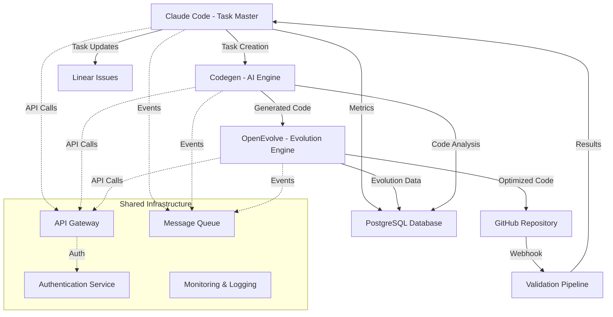

# Component Integration Architecture

## Communication Patterns

### OpenEvolve ↔ Codegen
- **Protocol**: REST API with WebSocket for real-time updates
- **Data Format**: JSON with structured schemas for code evolution requests
- **Authentication**: Shared API key authentication with JWT tokens
- **Rate Limiting**: 100 requests/minute for evolution operations, 1000/minute for status queries
- **Integration Points**:
  - Code generation requests from OpenEvolve to Codegen
  - Evolved code feedback from OpenEvolve to Codegen for learning
  - Codebase analysis requests for evolution context

### Codegen ↔ Claude Code
- **Protocol**: REST API with MCP (Model Context Protocol) integration
- **Data Format**: JSON with task-oriented schemas
- **Authentication**: OAuth 2.0 with scope-based permissions
- **Error Handling**: Retry logic with exponential backoff, circuit breaker pattern
- **Integration Points**:
  - Task creation and expansion from Claude Code to Codegen
  - Code generation status updates back to Claude Code
  - Dependency resolution coordination

### OpenEvolve ↔ Claude Code
- **Protocol**: Event-driven messaging via message queue (Redis/RabbitMQ)
- **Data Format**: JSON with evolution metrics and task completion data
- **Monitoring**: Health checks every 30 seconds, metrics collection via Prometheus
- **Feedback Loops**: Evolution results inform task complexity estimation
- **Integration Points**:
  - Task completion notifications from Claude Code to OpenEvolve
  - Evolution optimization results back to Claude Code for task refinement

## Data Flow Architecture

## Integration Challenges

### Challenge 1: Protocol Heterogeneity
- **Impact**: High - Different communication protocols across components
- **Complexity**: Medium - Requires protocol translation layer
- **Proposed Solution**: Implement API Gateway with protocol translation (REST ↔ MCP ↔ WebSocket)

### Challenge 2: Data Schema Alignment
- **Impact**: High - Inconsistent data formats between components
- **Complexity**: Medium - Need schema mapping and validation
- **Proposed Solution**: Define unified data schemas with component-specific adapters

### Challenge 3: Authentication Coordination
- **Impact**: Medium - Each component has different auth mechanisms
- **Complexity**: Low - Well-established patterns available
- **Proposed Solution**: Implement OAuth 2.0 with JWT tokens and shared identity provider

### Challenge 4: Error Propagation
- **Impact**: High - Failures in one component affect entire pipeline
- **Complexity**: High - Complex error handling across async operations
- **Proposed Solution**: Circuit breaker pattern with graceful degradation and retry logic

### Challenge 5: Performance Bottlenecks
- **Impact**: High - Evolution operations are computationally intensive
- **Complexity**: High - Need sophisticated load balancing and scaling
- **Proposed Solution**: Horizontal scaling with queue-based load distribution

### Challenge 6: State Synchronization
- **Impact**: Medium - Components need consistent view of system state
- **Complexity**: Medium - Distributed state management challenges
- **Proposed Solution**: Event sourcing with CQRS pattern for state management

### Challenge 7: Configuration Management
- **Impact**: Medium - Multiple configuration systems to coordinate
- **Complexity**: Low - Configuration management is well-understood
- **Proposed Solution**: Centralized configuration service with component-specific overlays

### Challenge 8: Monitoring and Observability
- **Impact**: High - Need visibility across all three components
- **Complexity**: Medium - Distributed tracing and metrics aggregation
- **Proposed Solution**: OpenTelemetry with centralized logging and metrics collection

## Recommended Architecture Patterns

### 1. API Gateway Pattern
- **Purpose**: Single entry point for all external requests
- **Benefits**: Centralized authentication, rate limiting, and protocol translation
- **Implementation**: Kong or AWS API Gateway with custom plugins

### 2. Event-Driven Architecture
- **Purpose**: Loose coupling between components
- **Benefits**: Scalability, resilience, and flexibility
- **Implementation**: Apache Kafka or Redis Streams for event streaming

### 3. Circuit Breaker Pattern
- **Purpose**: Prevent cascade failures
- **Benefits**: System resilience and graceful degradation
- **Implementation**: Hystrix or resilience4j libraries

### 4. CQRS with Event Sourcing
- **Purpose**: Separate read and write operations
- **Benefits**: Scalability and audit trail
- **Implementation**: EventStore or Apache Kafka for event sourcing

### 5. Microservices with Service Mesh
- **Purpose**: Independent deployment and scaling
- **Benefits**: Technology diversity and fault isolation
- **Implementation**: Istio or Linkerd for service mesh

## Security Considerations

### Authentication & Authorization
- **OAuth 2.0** with PKCE for secure authentication
- **JWT tokens** with short expiration times
- **Role-based access control** (RBAC) for fine-grained permissions
- **API key management** for service-to-service communication

### Data Protection
- **TLS 1.3** for all communication channels
- **Data encryption at rest** using AES-256
- **Secrets management** using HashiCorp Vault or AWS Secrets Manager
- **Input validation** and sanitization at all entry points

### Network Security
- **VPC isolation** for component deployment
- **Network policies** for traffic restriction
- **DDoS protection** at the API gateway level
- **Regular security audits** and penetration testing

## Scalability Strategy

### Horizontal Scaling
- **OpenEvolve**: Scale evaluation workers based on queue depth
- **Codegen**: Scale code generation instances based on request volume
- **Claude Code**: Scale task processing workers based on task complexity

### Vertical Scaling
- **Database optimization** with read replicas and connection pooling
- **Memory optimization** for large codebase analysis
- **CPU optimization** for evolution computations

### Caching Strategy
- **Redis** for session and temporary data caching
- **CDN** for static assets and documentation
- **Application-level caching** for expensive computations
- **Database query caching** for frequently accessed data

## Deployment Strategy

### Containerization
- **Docker containers** for all components
- **Multi-stage builds** for optimized image sizes
- **Security scanning** for container vulnerabilities
- **Resource limits** and health checks

### Orchestration
- **Kubernetes** for container orchestration
- **Helm charts** for deployment management
- **GitOps** with ArgoCD for continuous deployment
- **Blue-green deployments** for zero-downtime updates

### Monitoring & Observability
- **Prometheus** for metrics collection
- **Grafana** for visualization and alerting
- **Jaeger** for distributed tracing
- **ELK stack** for centralized logging

