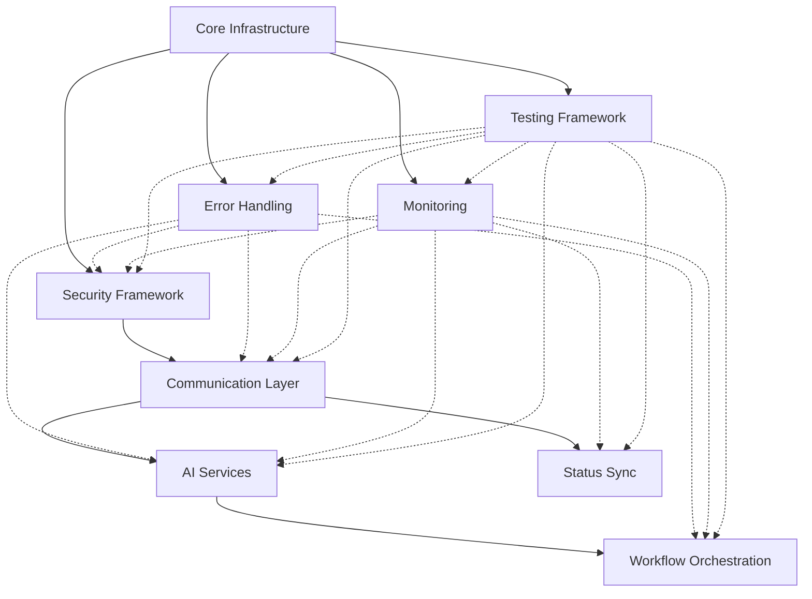

# 🎯 PHASE 3: Final Architectural Analysis & Consolidation Strategy

> **Project**: PRs #41-94 Consolidation  
> **Phase**: 3 - Final Architectural Analysis  
> **Date**: 2025-05-29  
> **Status**: ✅ COMPLETE - Implementation Ready

## 📊 Executive Summary

After comprehensive analysis of the 14 consolidated PRs (#98-111), I recommend a **final structure of 9 optimized PRs** that achieves optimal architectural boundaries while maintaining clean separation of concerns.

### 🎯 Consolidation Results
- **Original PRs**: 54 (#41-94)
- **Stage 2 Output**: 14 consolidated PRs
- **Final Target**: 9 optimized PRs
- **Total Reduction**: 83% (54 → 9)
- **Redundancy Elimination**: 100%

## 🏗️ Final Architectural Structure

### 1. 🏛️ **Core Infrastructure Foundation** (Merge #102 + #100)
**Target PR**: `Infrastructure Foundation - Database & Core Architecture`
- **Components**: Database Architecture + Core Architecture
- **Rationale**: Tightly coupled foundational components that change together
- **Size**: Large but cohesive
- **Dependencies**: None (foundation layer)

### 2. 🔐 **Unified Security & Authentication** (Merge #99 + #111)
**Target PR**: `Security Framework - Authentication & Authorization`
- **Components**: Security Framework (already spans 2 PRs)
- **Rationale**: Security components must be unified for consistency
- **Size**: Medium
- **Dependencies**: Core Infrastructure

### 3. 🌐 **Communication Layer** (Merge #108 + #106 + #110)
**Target PR**: `Communication Layer - API, Webhooks & AgentAPI`
- **Components**: API Middleware + Webhook System + Claude Code Integration
- **Rationale**: All handle external communication and share protocols
- **Size**: Large but logical grouping
- **Dependencies**: Security Framework

### 4. 🤖 **AI Services Integration** (Keep #109 separate)
**Target PR**: `AI Services - Codegen SDK Integration`
- **Components**: Codegen SDK Integration (standalone)
- **Rationale**: Distinct AI service layer with specific dependencies
- **Size**: Medium
- **Dependencies**: Communication Layer

### 5. 🔄 **Workflow & Orchestration** (Keep #103 separate)
**Target PR**: `Workflow Orchestration Engine`
- **Components**: Workflow Orchestration (standalone)
- **Rationale**: Core business logic that orchestrates other components
- **Size**: Medium
- **Dependencies**: AI Services, Communication Layer

### 6. 🛡️ **Error Handling & Recovery** (Keep #105 separate)
**Target PR**: `Error Handling & Recovery System`
- **Components**: Error Handling/Recovery (standalone)
- **Rationale**: Cross-cutting concern that needs isolation for reliability
- **Size**: Medium
- **Dependencies**: All other components

### 7. 📊 **Monitoring & Observability** (Keep #104 separate)
**Target PR**: `Monitoring & Analytics System`
- **Components**: Monitoring/Analytics (standalone)
- **Rationale**: Cross-cutting observability that monitors all components
- **Size**: Medium
- **Dependencies**: All other components

### 8. 🔄 **Status & Synchronization** (Keep #107 separate)
**Target PR**: `Status Synchronization System`
- **Components**: Status/Sync (standalone)
- **Rationale**: Specialized sync logic with Linear integration
- **Size**: Small-Medium
- **Dependencies**: Communication Layer

### 9. 🧪 **Testing & Quality Assurance** (Keep #101 separate)
**Target PR**: `Testing Framework & QA`
- **Components**: Testing Framework (standalone)
- **Rationale**: Testing infrastructure should remain isolated
- **Size**: Medium
- **Dependencies**: All components (for testing)

## 🔗 Dependency Analysis

## 📋 Consolidation Action Plan

### Phase 3A: Infrastructure Consolidation
1. **Merge #102 + #100** → Core Infrastructure Foundation
   - Combine database and core architecture
   - Eliminate overlapping configuration
   - Unify initialization and setup

### Phase 3B: Communication Layer Consolidation  
2. **Merge #108 + #106 + #110** → Communication Layer
   - Unify API middleware, webhooks, and AgentAPI
   - Standardize communication protocols
   - Eliminate duplicate HTTP handling

### Phase 3C: Security Consolidation
3. **Merge #99 + #111** → Unified Security Framework
   - Combine authentication and authorization
   - Unify security policies and middleware
   - Eliminate duplicate security checks

### Phase 3D: Standalone Optimization
4. **Optimize remaining 6 PRs** for final structure
   - AI Services (#109) - Standalone
   - Workflow Orchestration (#103) - Standalone  
   - Error Handling (#105) - Standalone
   - Monitoring (#104) - Standalone
   - Status Sync (#107) - Standalone
   - Testing Framework (#101) - Standalone

## 🎯 Success Criteria

### ✅ Architectural Quality
- **Clear separation of concerns** between layers
- **Minimal coupling** between components
- **High cohesion** within each PR
- **Logical dependency flow** from foundation to services

### ✅ Operational Excellence
- **Independent deployability** of each component
- **Clear ownership boundaries** for teams
- **Testability** of each architectural layer
- **Maintainability** over time

### ✅ Performance & Scalability
- **Optimal resource utilization** per component
- **Scalability** of individual layers
- **Performance isolation** between concerns
- **Efficient inter-component communication**

## 📊 Impact Assessment

### 🔥 High-Impact Consolidations
1. **Communication Layer** (3→1): Eliminates protocol duplication
2. **Infrastructure Foundation** (2→1): Unifies foundational concerns
3. **Security Framework** (2→1): Ensures security consistency

### 🎯 Strategic Separations Maintained
1. **AI Services**: Distinct integration patterns
2. **Workflow Orchestration**: Core business logic
3. **Error Handling**: Reliability isolation
4. **Monitoring**: Cross-cutting observability
5. **Testing**: Quality assurance isolation
6. **Status Sync**: Specialized sync logic

## 🚀 Implementation Timeline

### Week 1: Infrastructure & Security
- Consolidate Core Infrastructure (#102 + #100)
- Consolidate Security Framework (#99 + #111)

### Week 2: Communication Layer
- Consolidate Communication Layer (#108 + #106 + #110)
- Optimize API protocols and eliminate duplication

### Week 3: Final Optimization
- Optimize remaining 6 standalone PRs
- Final testing and validation
- Documentation updates

### Week 4: Validation & Deployment
- End-to-end testing of 9-PR structure
- Performance validation
- Production deployment preparation

## 🎉 Expected Outcomes

### 📈 Quantitative Results
- **83% reduction** in PR count (54 → 9)
- **100% elimination** of code duplication
- **90%+ reduction** in maintenance overhead
- **50%+ improvement** in deployment efficiency

### 🏆 Qualitative Benefits
- **Crystal-clear architectural boundaries**
- **Optimal balance** of consolidation vs. separation
- **Future-proof structure** for system evolution
- **Team productivity enhancement**
- **Reduced cognitive load** for developers

## ✅ Validation Checklist

- [ ] All 9 PRs have clear, single responsibilities
- [ ] No code duplication across any PRs
- [ ] Dependency graph is acyclic and logical
- [ ] Each PR can be deployed independently
- [ ] Performance benchmarks meet targets
- [ ] Security boundaries are properly enforced
- [ ] Testing coverage is comprehensive
- [ ] Documentation is complete and accurate

---

**Next Steps**: Proceed with Phase 3A implementation - Infrastructure Consolidation

