# 🎯 Task Orchestration Engine

> **Intelligent CI/CD Workflow Orchestration with Natural Language Processing**

The Task Orchestration Engine is a sophisticated system that transforms natural language requirements into fully automated CI/CD workflows, coordinating multiple AI agents to deliver complete software solutions.

## ✨ Key Features

🧠 **Natural Language Processing** - Parse complex requirements into actionable tasks  
🔄 **Workflow Orchestration** - Coordinate entire CI/CD pipelines automatically  
🤖 **Agent Coordination** - Manage multiple coding agents (Claude Code, Goose, Aider, Codex)  
📊 **PostgreSQL Integration** - Persistent state management and task tracking  
🔧 **Dependency Resolution** - Intelligent task ordering and parallel execution  
🛡️ **Error Recovery** - Sophisticated retry mechanisms and failure handling  
📈 **Real-time Monitoring** - Track progress and performance metrics  
🔌 **MCP Integration** - Full Model Context Protocol support for Cursor/Claude

## 🚀 Quick Start

### 1. Initialize Orchestration

```bash
# CLI
task-master orchestration init

# MCP (in Cursor/Claude)
await mcp.call('init_orchestration', {
  enableNLP: true,
  enableAgentCoordination: true
});
```

### 2. Process Natural Language Requirements

```bash
# Parse requirements into tasks
task-master orchestration parse "Create a REST API for user management with JWT authentication"

# Process with orchestration
task-master orchestration process 123 --priority high
```

### 3. Monitor Workflows

```bash
# Check status
task-master orchestration status

# Monitor specific workflow
task-master orchestration monitor workflow_123_456
```

## 🏗️ Architecture Overview

```
┌─────────────────────────────────────────────────────────────┐
│                 🎯 Orchestration Engine                     │
├─────────────────────────────────────────────────────────────┤
│  🧠 NLP Parser    🔄 State Machine    🔗 Dependency Resolver │
│  🤖 Agent Coord   🛡️ Error Recovery   📊 Database Manager   │
│  🎛️ State Manager - Centralized Control & Persistence      │
└─────────────────────────────────────────────────────────────┘
```

### Workflow States

```mermaid
graph LR
    A[📝 PENDING] --> B[🧠 NLP_PARSING]
    B --> C[🔧 TASK_DECOMPOSITION]
    C --> D[🔗 DEPENDENCY_RESOLUTION]
    D --> E[🤖 AGENT_ASSIGNMENT]
    E --> F[⚡ PROCESSING]
    F --> G[📋 PR_CREATED]
    G --> H[🧪 VALIDATION_RUNNING]
    H --> I[✅ VALIDATION_PASSED]
    H --> J[❌ VALIDATION_FAILED]
    I --> K[🎉 MERGED]
    J --> F
```



## 🛠️ Installation & Setup

### Prerequisites

- Node.js 18+
- PostgreSQL 12+
- Access to AI providers (Anthropic/OpenAI)
- AgentAPI setup (optional)

### Environment Configuration

```bash
# Database
DB_HOST=localhost
DB_PORT=5432
DB_NAME=codegen_taskmaster_db
DB_USER=software_developer
DB_PASSWORD=your_password

# AI Providers
ANTHROPIC_API_KEY=your_anthropic_key
OPENAI_API_KEY=your_openai_key

# Agent Coordination
AGENTAPI_URL=http://localhost:8000
AGENTAPI_KEY=your_agent_key

# Orchestration Settings
MAX_CONCURRENT_WORKFLOWS=20
ENABLE_NLP=true
ENABLE_AGENT_COORDINATION=true
```

### Database Setup

```sql
-- Create database
CREATE DATABASE codegen_taskmaster_db;
CREATE USER software_developer WITH PASSWORD 'your_password';
GRANT ALL PRIVILEGES ON DATABASE codegen_taskmaster_db TO software_developer;
```

## 📖 Usage Examples

### Basic Task Processing

```javascript
import { OrchestrationEngine } from './src/orchestration/index.js';

// Initialize engine
const engine = new OrchestrationEngine({
  database: { host: 'localhost', port: 5432 },
  nlp: { provider: 'anthropic' }
});

await engine.initialize();

// Process a task
const result = await engine.processTask('task_123', {
  priority: 'high',
  enableNLP: true
});

console.log(`Workflow ${result.workflowId} started`);
```

### Natural Language Processing

```javascript
// Parse complex requirements
const requirements = `
Create a user authentication system with the following features:
1. User registration with email validation
2. JWT-based login system
3. Password reset functionality
4. Role-based access control
5. API rate limiting
`;

const parsed = await engine.parseRequirements(requirements);

// Results in structured tasks:
// - Create user model and database schema
// - Implement registration endpoint with email validation
// - Build JWT authentication middleware
// - Create password reset flow
// - Implement RBAC system
// - Add rate limiting middleware
```

### Batch Processing

```javascript
// Process multiple related tasks
const taskIds = ['auth_system', 'user_api', 'admin_panel'];
const batchResult = await engine.processBatch(taskIds, {
  priority: 'high',
  enableAgentCoordination: true
});

console.log(`Processed ${batchResult.successful}/${batchResult.total} tasks`);
```

### Workflow Monitoring

```javascript
// Real-time workflow monitoring
const workflowId = 'workflow_123_456';

const monitorWorkflow = async () => {
  const status = await engine.getWorkflowStatus(workflowId);
  
  console.log(`Status: ${status.status}`);
  console.log(`Progress: ${status.progress}%`);
  console.log(`Current Step: ${status.currentStep}`);
  
  if (!['merged', 'failed', 'cancelled'].includes(status.status)) {
    setTimeout(monitorWorkflow, 5000); // Check every 5 seconds
  }
};

monitorWorkflow();
```

## 🤖 Agent Coordination

The orchestration engine coordinates multiple AI coding agents:

### Supported Agents

| Agent | Capabilities | Best For |
|-------|-------------|----------|
| **Claude Code** | Full-stack, testing, debugging | Complex features, testing |
| **Goose** | Backend, CLI tools, automation | Server-side logic, scripts |
| **Aider** | Code editing, git integration | Incremental changes, refactoring |
| **Codex** | Code completion, translation | Boilerplate, language conversion |

### Automatic Agent Selection

```javascript
// Engine automatically selects best agent based on:
const task = {
  type: 'implementation',
  language: 'javascript',
  complexity: 'high',
  requirements: ['testing', 'api_development']
};

// Results in Claude Code assignment for comprehensive development
```

## 🧠 Natural Language Processing

### Requirement Parsing

Transform natural language into structured tasks:

```javascript
// Input
"Build a real-time chat application with WebSocket support"

// Output
{
  actionableItems: [
    {
      id: 'chat_1',
      title: 'Set up WebSocket server',
      type: 'implementation',
      priority: 'high',
      dependencies: [],
      acceptanceCriteria: ['WebSocket server running', 'Connection handling']
    },
    {
      id: 'chat_2', 
      title: 'Create chat UI components',
      type: 'implementation',
      priority: 'medium',
      dependencies: ['chat_1'],
      acceptanceCriteria: ['Message display', 'Input handling', 'Real-time updates']
    }
  ],
  dependencies: [
    { from: 'chat_2', to: 'chat_1', type: 'hard', reason: 'UI needs server' }
  ],
  metadata: {
    complexity: 'high',
    technologies: ['websocket', 'javascript', 'react'],
    estimatedTime: '8-12 hours'
  }
}
```

### Task Classification

Automatically categorizes tasks:

- **Implementation**: New feature development
- **Testing**: Unit/integration test creation
- **Documentation**: README, API docs
- **Bugfix**: Error resolution
- **Refactor**: Code improvement
- **Integration**: System connections
- **Deployment**: Release preparation

## 🔄 Dependency Resolution

Intelligent task ordering and parallel execution:

```javascript
// Complex dependency graph
const tasks = [
  { id: 'database', dependencies: [] },
  { id: 'api', dependencies: ['database'] },
  { id: 'auth', dependencies: ['database'] },
  { id: 'frontend', dependencies: ['api', 'auth'] },
  { id: 'tests', dependencies: ['frontend'] }
];

// Execution plan with parallel opportunities
const plan = await dependencyResolver.resolveDependencies(tasks);
// Level 0: [database]
// Level 1: [api, auth] (parallel)
// Level 2: [frontend]
// Level 3: [tests]
```

## 🛡️ Error Handling & Recovery

Sophisticated error recovery with multiple strategies:

### Error Types & Strategies

| Error Type | Recovery Strategy | Max Attempts |
|------------|------------------|--------------|
| Network Error | Exponential backoff | 5 |
| Rate Limit | Extended backoff | 3 |
| Dependency Error | Graph resolution | 2 |
| Resource Error | Resource optimization | 2 |
| Agent Error | Agent reassignment | 3 |

### Custom Recovery

```javascript
// Register custom recovery strategy
errorRecovery.registerRecoveryStrategy('CUSTOM_ERROR', {
  name: 'custom_recovery',
  maxAttempts: 3,
  baseDelay: 5000,
  recoveryAction: async (workflowId, error, context) => {
    // Custom recovery logic
    return await handleCustomError(workflowId, error);
  }
});
```

## 📊 Monitoring & Metrics

### Performance Dashboard

```javascript
const metrics = engine.getMetrics();

console.log(`
📊 Orchestration Metrics:
• Active Workflows: ${metrics.orchestrator.activeWorkflows}
• Success Rate: ${metrics.orchestrator.successRate}%
• Avg Execution Time: ${metrics.orchestrator.averageExecutionTime}ms
• Agent Utilization: ${JSON.stringify(metrics.agentUtilization)}
`);
```

### Health Monitoring

```javascript
const health = await engine.healthCheck();

// Component health status
health.components.forEach(component => {
  console.log(`${component.name}: ${component.status}`);
});
```

## 🔌 MCP Integration

Full Model Context Protocol support for Cursor and Claude:

### Available MCP Tools

```javascript
// Initialize orchestration in Cursor
await mcp.call('init_orchestration', {
  enableNLP: true,
  maxConcurrentWorkflows: 10
});

// Process task with natural language
await mcp.call('process_task_orchestration', {
  taskId: 'user_auth_system',
  priority: 'high'
});

// Parse requirements
await mcp.call('parse_requirements', {
  description: "Create a microservices architecture with Docker"
});

// Monitor workflow
await mcp.call('get_workflow_status', {
  workflowId: 'workflow_123'
});
```

## 🧪 Testing

### Test Coverage

```bash
# Unit tests
npm test -- --grep "orchestration"

# Integration tests  
npm run test:integration

# End-to-end tests
npm run test:e2e -- orchestration

# Performance tests
npm run test:performance -- --workflows 50
```

### Test Examples

```javascript
describe('TaskOrchestrator', () => {
  it('should process task with NLP', async () => {
    const result = await orchestrator.processTask('test_task', {
      enableNLP: true
    });
    
    expect(result.workflowId).toBeDefined();
    expect(result.status).toBe('processing');
  });
  
  it('should handle batch processing', async () => {
    const result = await orchestrator.processBatch(['task1', 'task2']);
    
    expect(result.total).toBe(2);
    expect(result.successful).toBeGreaterThan(0);
  });
});
```

## 🚀 Production Deployment

### Docker Setup

```dockerfile
# Dockerfile
FROM node:18-alpine
WORKDIR /app
COPY package*.json ./
RUN npm ci --only=production
COPY . .
EXPOSE 3000
CMD ["npm", "start"]
```

```yaml
# docker-compose.yml
version: '3.8'
services:
  orchestration:
    build: .
    environment:
      - DB_HOST=postgres
      - ANTHROPIC_API_KEY=${ANTHROPIC_API_KEY}
    depends_on:
      - postgres
      
  postgres:
    image: postgres:14
    environment:
      - POSTGRES_DB=codegen_taskmaster_db
      - POSTGRES_USER=software_developer
      - POSTGRES_PASSWORD=${DB_PASSWORD}
```

### Scaling Configuration

```javascript
// Production configuration
const engine = new OrchestrationEngine({
  orchestrator: {
    maxConcurrentWorkflows: 100,
    taskTimeout: 1800000, // 30 minutes
    retryAttempts: 5
  },
  database: {
    maxConnections: 50,
    connectionTimeout: 30000
  },
  stateManager: {
    persistState: true,
    saveInterval: 10000 // 10 seconds
  }
});
```

## 📚 API Reference

### Core Classes

```javascript
// Main orchestration engine
class OrchestrationEngine {
  async initialize()
  async processTask(taskId, options)
  async processBatch(taskIds, options)
  async getWorkflowStatus(workflowId)
  async cancelWorkflow(workflowId)
  getMetrics()
  async healthCheck()
  async shutdown()
}

// Natural language processing
class TaskNLP {
  async parseRequirements(description, context)
  async decomposeTask(actionableItems, originalTask)
  async generateInstructions(task, context)
  async validateCompletion(task, result)
}

// Agent coordination
class AgentCoordinator {
  async assignTasks(executionPlan)
  async executeTask(assignment, context)
  async monitorExecution(sessionId)
  findBestAgent(task, requirements)
}
```

## 🔧 Configuration Options

### Complete Configuration

```javascript
const config = {
  // Database configuration
  database: {
    host: 'localhost',
    port: 5432,
    database: 'codegen_taskmaster_db',
    username: 'software_developer',
    password: 'password',
    ssl: true,
    maxConnections: 20
  },
  
  // NLP configuration
  nlp: {
    provider: 'anthropic', // or 'openai'
    model: 'claude-3-5-sonnet-20241022',
    enableCaching: true,
    maxTokens: 4000,
    temperature: 0.1
  },
  
  // Agent coordination
  agentapi: {
    agentApiUrl: 'http://localhost:8000',
    apiKey: 'your_api_key',
    maxConcurrentAgents: 5,
    timeout: 300000
  },
  
  // Orchestrator settings
  orchestrator: {
    maxConcurrentWorkflows: 20,
    taskTimeout: 600000, // 10 minutes
    retryAttempts: 3,
    enableNLP: true,
    enableAgentCoordination: true
  },
  
  // State management
  stateManager: {
    persistState: true,
    autoSave: true,
    saveInterval: 30000,
    stateFile: '.orchestrator-state.json'
  }
};
```

## 🤝 Contributing

We welcome contributions! Here's how to get started:

1. **Fork the repository**
2. **Create a feature branch**: `git checkout -b feature/orchestration-enhancement`
3. **Make your changes** and add comprehensive tests
4. **Run the test suite**: `npm test`
5. **Submit a pull request** with detailed description

### Development Setup

```bash
# Clone and setup
git clone https://github.com/Zeeeepa/claude-task-master.git
cd claude-task-master
npm install

# Start development database
docker-compose up -d postgres

# Run in development mode
npm run dev

# Run tests
npm test
```

## 📄 License

MIT License with Commons Clause - see [LICENSE](LICENSE) for details.

## 🆘 Support & Community

- 📖 **Documentation**: [Full Documentation](docs/orchestration-engine.md)
- 🐛 **Issues**: [GitHub Issues](https://github.com/Zeeeepa/claude-task-master/issues)
- 💬 **Discord**: [TaskMaster AI Community](https://discord.gg/taskmasterai)
- 📧 **Email**: support@taskmaster.ai

## 🎯 Roadmap

### Current Version (v1.0)
- ✅ Natural language processing
- ✅ Agent coordination
- ✅ Workflow orchestration
- ✅ Error recovery
- ✅ MCP integration

### Upcoming Features (v1.1)
- 🔄 Advanced workflow templates
- 📊 Enhanced analytics dashboard
- 🔌 Additional agent integrations
- 🌐 Multi-language support
- 📱 Mobile monitoring app

### Future Vision (v2.0)
- 🤖 Self-improving AI workflows
- 🌍 Distributed orchestration
- 🔒 Enterprise security features
- 📈 Predictive analytics
- 🎨 Visual workflow designer

---

**The Task Orchestration Engine represents the future of AI-driven development - where natural language becomes code, and intelligent agents work together to build complete software solutions.**

*Built with ❤️ by the TaskMaster AI team*

