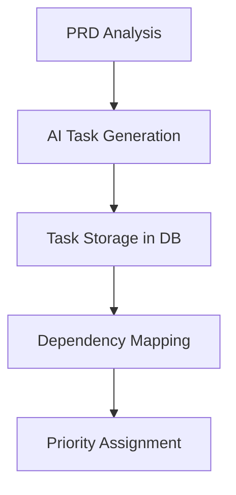
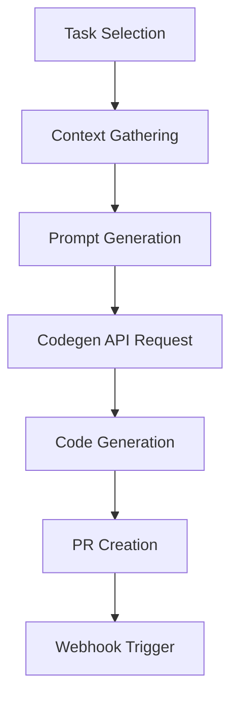
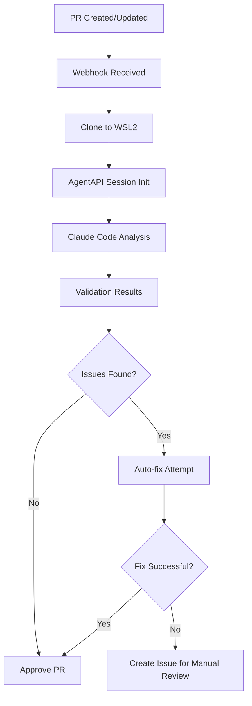
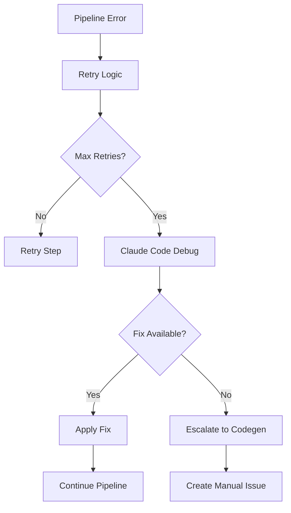

# Claude Task Master - AI-Powered CI/CD Orchestration System

[](https://github.com/eyaltoledano/claude-task-master/actions/workflows/ci.yml) [](https://badge.fury.io/js/task-master-ai) [](https://discord.gg/taskmasterai) [](LICENSE)

### By [@eyaltoledano](https://x.com/eyaltoledano) & [@RalphEcom](https://x.com/RalphEcom)

[](https://x.com/eyaltoledano)
[](https://x.com/RalphEcom)

## 🚀 Overview

Claude Task Master is a comprehensive AI-powered CI/CD orchestration system that integrates multiple AI agents and tools to automate the entire software development lifecycle. It combines intelligent task management, automated code generation, PR validation, and deployment orchestration into a unified platform.

## 🏗️ Architecture

The system consists of four main components working together:

```
┌─────────────────┐    ┌──────────────────┐    ┌─────────────────┐
│   Codegen API   │    │  Claude Code     │    │   PostgreSQL    │
│   (AI Agent)    │◄──►│  (via AgentAPI)  │◄──►│   Database      │
└─────────────────┘    └──────────────────┘    └─────────────────┘
         ▲                        ▲                       ▲
         │                        │                       │
         ▼                        ▼                       ▼
┌─────────────────────────────────────────────────────────────────┐
│              Claude Task Master Orchestrator                    │
│  ┌─────────────┐ ┌─────────────┐ ┌─────────────┐ ┌─────────────┐│
│  │Task Manager │ │CI/CD Engine │ │AgentAPI     │ │Webhook      ││
│  │             │ │             │ │Client       │ │Handler      ││
│  └─────────────┘ └─────────────┘ └─────────────┘ └─────────────┘│
└─────────────────────────────────────────────────────────────────┘
         ▲                                                 ▲
         │                                                 │
         ▼                                                 ▼
┌─────────────────┐                               ┌─────────────────┐
│   GitHub/GitLab │                               │   WSL2 Instance │
│   Repositories  │                               │   (Deployment)  │
└─────────────────┘                               └─────────────────┘
```

### Component Responsibilities

1. **Claude Task Master Orchestrator** (Core System)
   - Central coordination engine
   - Task management and planning
   - CI/CD pipeline orchestration
   - Webhook event processing
   - Database operations

2. **AgentAPI Middleware** ([agentapi](https://github.com/Zeeeepa/agentapi))
   - HTTP API for controlling coding agents
   - Manages Claude Code, Goose, Aider, and Codex
   - Terminal emulation and message parsing
   - Session management

3. **Claude Code** (AI Validation Agent)
   - PR code review and validation
   - Error analysis and debugging
   - Automated fix suggestions
   - Security and performance analysis

4. **Codegen API** (Code Generation Agent)
   - Natural language to code generation
   - Task-based development
   - PR creation and management
   - Context-aware implementations

5. **PostgreSQL Database**
   - Project and task storage
   - Pipeline state management
   - Audit trails and metrics
   - Prompt templates and configurations

## 🔄 CI/CD Development Flow

### 1. Task Creation & Planning


### 2. Code Generation Workflow


### 3. PR Validation Pipeline


### 4. Error Handling & Recovery


## 🛠️ Installation & Setup

### Prerequisites

- Node.js 18+ 
- PostgreSQL 13+
- WSL2 (for Windows users)
- AgentAPI server
- Claude Code installed globally

### 1. Database Setup

```bash
# Create PostgreSQL database
createdb claude_task_master

# Set environment variables
export DB_HOST=localhost
export DB_PORT=5432
export DB_NAME=claude_task_master
export DB_USER=postgres
export DB_PASSWORD=your_password
```

### 2. Install Claude Task Master

```bash
# Install globally
npm install -g task-master-ai

# Or clone and install locally
git clone https://github.com/Zeeeepa/claude-task-master.git
cd claude-task-master
npm install
```

### 3. Install AgentAPI

```bash
# Download latest release from https://github.com/Zeeeepa/agentapi/releases
# Or build from source
git clone https://github.com/Zeeeepa/agentapi.git
cd agentapi
go build -o agentapi
```

### 4. Install Claude Code

```bash
npm install -g @anthropic-ai/claude-code
```

### 5. Configuration

Create `.env` file:

```env
# Database Configuration
DB_HOST=localhost
DB_PORT=5432
DB_NAME=claude_task_master
DB_USER=postgres
DB_PASSWORD=your_password
DB_SSL_MODE=disable

# API Keys
ANTHROPIC_API_KEY=your_anthropic_key
CODEGEN_API_KEY=your_codegen_key
OPENAI_API_KEY=your_openai_key

# Service URLs
AGENTAPI_URL=http://localhost:3284
CODEGEN_API_URL=https://api.codegen.sh

# WSL2 Configuration
WSL2_INSTANCE_PATH=/mnt/c/projects

# Server Configuration
PORT=3000
NODE_ENV=production
```

## 🚀 Quick Start

### 1. Start the Services

```bash
# Terminal 1: Start AgentAPI with Claude Code
agentapi server -- claude --allowedTools "Bash(git*) Edit Replace"

# Terminal 2: Start Claude Task Master
npm start
# or
node src/index.js
```

### 2. Create a Project

```bash
curl -X POST http://localhost:3000/api/projects \
  -H "Content-Type: application/json" \
  -d '{
    "name": "My Project",
    "description": "AI-powered web application",
    "repositoryUrl": "https://github.com/user/repo",
    "repositoryOwner": "user",
    "repositoryName": "repo"
  }'
```

### 3. Setup Webhook

Add webhook to your GitHub repository:
- URL: `http://your-server:3000/webhook`
- Content type: `application/json`
- Events: `Pull requests`, `Pushes`, `Issues`

### 4. Generate Tasks from PRD

```bash
curl -X POST http://localhost:3000/api/tasks/parse-prd \
  -H "Content-Type: application/json" \
  -d '{
    "project_id": "your-project-id",
    "prd_path": "./scripts/prd.txt"
  }'
```

## 📋 API Reference

### Projects

- `GET /api/projects` - List all projects
- `POST /api/projects` - Create new project
- `GET /api/projects/:id` - Get project details

### Tasks

- `GET /api/tasks?project_id=:id` - List project tasks
- `POST /api/tasks` - Create new task
- `GET /api/tasks/next?project_id=:id` - Get next task to work on
- `PUT /api/tasks/:id` - Update task

### Pipelines

- `POST /api/pipelines/validate-pr` - Validate PR with Claude Code
- `POST /api/pipelines/generate-code` - Generate code from tasks
- `GET /api/pipelines/:id/status` - Get pipeline status

### Webhooks

- `POST /webhook` - GitHub/GitLab webhook endpoint

## 🔧 Advanced Configuration

### Custom Prompt Templates

The system uses PostgreSQL-stored prompt templates for different operations:

```sql
INSERT INTO prompt_templates (name, template_type, content, variables) VALUES (
  'custom_validation',
  'validation',
  'Analyze this PR for {{validation_focus}} in {{project_name}}...',
  '["validation_focus", "project_name"]'
);
```

### WSL2 Instance Configuration

For Windows users, configure WSL2 for code deployment:

```json
{
  "wsl2InstancePath": "/mnt/c/projects",
  "deploymentConfig": {
    "autoClone": true,
    "workspaceSetup": [
      "npm install",
      "npm run build"
    ]
  }
}
```

### AgentAPI Integration

Configure multiple agent types:

```json
{
  "agentapiConfig": {
    "claude": {
      "model": "claude-3-sonnet",
      "allowedTools": ["Bash(git*)", "Edit", "Replace"],
      "maxTokens": 4096
    },
    "aider": {
      "model": "gpt-4",
      "apiKey": "your-openai-key"
    }
  }
}
```

## 🔍 Monitoring & Observability

### Health Checks

```bash
curl http://localhost:3000/health
```

Response:
```json
{
  "status": "healthy",
  "timestamp": "2025-05-29T02:26:00.000Z",
  "database": {
    "connected": true,
    "pools": ["primary"],
    "metrics": {
      "totalQueries": 1250,
      "averageQueryTime": 15.5
    }
  },
  "components": {
    "database": "connected",
    "orchestrator": "initialized",
    "taskManager": "initialized"
  }
}
```

### Pipeline Metrics

Monitor CI/CD pipeline performance:

```sql
SELECT 
  pipeline_type,
  AVG(duration_ms) as avg_duration,
  COUNT(*) as total_runs,
  COUNT(*) FILTER (WHERE status = 'completed') as successful_runs
FROM ci_cd_pipelines 
WHERE created_at > NOW() - INTERVAL '7 days'
GROUP BY pipeline_type;
```

## 🔐 Security Considerations

- **Webhook Security**: Verify webhook signatures
- **API Authentication**: Implement JWT or API key authentication
- **Database Security**: Use SSL connections and encrypted passwords
- **Code Execution**: Sandbox code execution in WSL2 instances
- **Secret Management**: Store API keys securely

## 🤝 Contributing

1. Fork the repository
2. Create a feature branch
3. Make your changes
4. Add tests
5. Submit a pull request

## 📄 License

This project is licensed under the MIT License with Commons Clause. See [LICENSE](LICENSE) for details.

## 🆘 Support

- 📖 [Documentation](docs/)
- 💬 [Discord Community](https://discord.gg/taskmasterai)
- 🐛 [Issue Tracker](https://github.com/Zeeeepa/claude-task-master/issues)
- 📧 [Email Support](mailto:support@taskmasterai.com)

## 🗺️ Roadmap

- [ ] Multi-cloud deployment support
- [ ] Advanced AI model integration
- [ ] Real-time collaboration features
- [ ] Enterprise SSO integration
- [ ] Advanced analytics dashboard
- [ ] Plugin ecosystem

---

**Transform your development workflow with AI-powered automation. Start building the future of software development today!** 🚀
