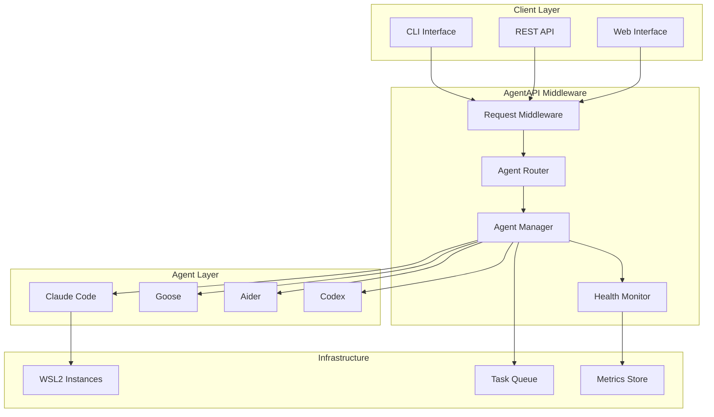

# AgentAPI Middleware Integration

## Overview

The AgentAPI Middleware Integration is a comprehensive system that orchestrates communication between AI agents (Claude Code, Goose, Aider, Codex) and the claude-task-master system. It provides intelligent request routing, health monitoring, failover handling, and WSL2 instance management.

## Architecture



## Components

### 1. AgentAPI Configuration (`agentapi_config.js`)

Central configuration management for all agents and system settings.

**Key Features:**
- Agent capability definitions
- WSL2 instance configuration
- Routing and load balancing settings
- Security and rate limiting configuration
- Environment-specific overrides

**Example Usage:**
```javascript
import { AGENTAPI_CONFIG, getAgentConfig } from './config/agentapi_config.js';

// Get configuration for specific agent
const claudeConfig = getAgentConfig('claude-code');

// Get agents by capability
const deploymentAgents = getAgentsByCapability('pr_deployment');
```

### 2. AgentAPI Client (`agentapi_client.js`)

HTTP client for communicating with the AgentAPI service.

**Key Features:**
- Automatic agent selection
- Circuit breaker pattern
- Retry logic with exponential backoff
- Request/response transformation
- Connection pooling

**Example Usage:**
```javascript
import AgentAPIClient from './integrations/agentapi_client.js';

const client = new AgentAPIClient({
    base_url: 'http://localhost:8080',
    api_key: 'your-api-key'
});

const result = await client.routeTask({
    task_id: 'task-123',
    task_type: 'pr_deployment',
    repository: {
        url: 'https://github.com/org/repo',
        branch: 'feature/new-feature'
    }
});
```

### 3. Agent Router (`agent_router.js`)

Intelligent routing system that selects the best agent for each task.

**Routing Strategies:**
- **Capability Priority**: Routes based on agent capabilities and priority
- **Round Robin**: Distributes tasks evenly across agents
- **Least Loaded**: Routes to agents with lowest current load
- **Performance Based**: Routes based on historical performance metrics

**Example Usage:**
```javascript
import AgentRouter from './integrations/agent_router.js';

const router = new AgentRouter(config, healthMonitor);

const selectedAgent = await router.selectAgent({
    task_type: 'code_generation',
    requirements: ['generate', 'validate']
});
```

### 4. Agent Manager (`agent_manager.js`)

Central orchestrator for agent lifecycle, task execution, and resource management.

**Key Features:**
- Task queue management
- Concurrent task execution
- WSL2 instance lifecycle
- Performance metrics collection
- Agent health coordination

**Example Usage:**
```javascript
import AgentManager from './integrations/agent_manager.js';

const manager = new AgentManager(config, healthMonitor);

const result = await manager.executeTask({
    task_type: 'pr_deployment',
    repository: { url: 'https://github.com/org/repo' }
});
```

### 5. Agent Health Monitor (`agent_health_monitor.js`)

Real-time monitoring system for agent health and performance.

**Key Features:**
- Continuous health checks
- Performance metrics tracking
- Alert management
- Circuit breaker implementation
- Availability calculations

**Example Usage:**
```javascript
import AgentHealthMonitor from './utils/agent_health_monitor.js';

const monitor = new AgentHealthMonitor(config);

const isHealthy = await monitor.isAgentHealthy('claude-code');
const healthSummary = monitor.getHealthSummary();
```

### 6. Agent Middleware (`agent_middleware.js`)

Express middleware for request processing, authentication, and rate limiting.

**Middleware Functions:**
- Authentication and authorization
- Rate limiting
- Request validation and transformation
- CORS handling
- Security headers
- Error handling

**Example Usage:**
```javascript
import AgentMiddleware from './middleware/agent_middleware.js';

const middleware = new AgentMiddleware(config);

app.use(middleware.authenticate());
app.use(middleware.rateLimit());
app.use(middleware.validateRequest());
```

### 7. Agent Endpoints (`agent_endpoints.js`)

RESTful API endpoints for agent management and task routing.

**Available Endpoints:**

#### Task Routing
- `POST /agents/route` - Route task to appropriate agent
- `GET /agents/queue` - Get task queue status
- `DELETE /agents/queue/:taskId` - Cancel queued task
- `POST /agents/recommend` - Get agent recommendations

#### Agent Management
- `GET /agents/status` - Get all agents status
- `GET /agents/:agentType/status` - Get specific agent status
- `POST /agents/:agentType/restart` - Restart specific agent
- `POST /agents/claude-code/deploy` - Deploy PR to WSL2 instance

#### Health Monitoring
- `GET /health` - System health check
- `GET /agents/:agentType/health` - Individual agent health
- `POST /agents/:agentType/health-check` - Force health check
- `GET /alerts` - Get active alerts

#### Metrics and Administration
- `GET /metrics` - Get system metrics
- `GET /metrics/routing` - Get routing statistics
- `POST /admin/circuit-breakers/reset` - Reset circuit breakers

## Agent Capabilities

### Claude Code
- **Capabilities**: PR deployment, code validation, error debugging, code review
- **Special Features**: WSL2 instance support, Git operations
- **Use Cases**: PR validation, deployment testing, complex debugging

### Goose
- **Capabilities**: Code generation, refactoring, optimization, documentation
- **Special Features**: Context-aware generation, multi-file operations
- **Use Cases**: Feature development, code optimization, documentation

### Aider
- **Capabilities**: Code editing, file management, Git operations, refactoring
- **Special Features**: Tree-sitter integration, diff context
- **Use Cases**: Targeted code changes, file operations, Git workflows

### Codex
- **Capabilities**: Code completion, documentation, testing, code analysis
- **Special Features**: Fast completion, test generation
- **Use Cases**: Code completion, test generation, quick analysis

## Configuration

### Environment Variables

```bash
# AgentAPI Configuration
AGENTAPI_URL=http://localhost:8080
AGENTAPI_KEY=your-api-key

# Security Settings
JWT_SECRET=your-jwt-secret
ENABLE_RATE_LIMITING=true
ALLOWED_ORIGINS=http://localhost:3000,https://yourdomain.com

# WSL2 Configuration
WSL2_MAX_INSTANCES=5
WSL2_INSTANCE_TIMEOUT=1800000

# Monitoring
ENABLE_METRICS=true
HEALTH_CHECK_INTERVAL=30000
METRICS_INTERVAL=60000
```

### Configuration File Example

```javascript
export const config = {
    base_url: process.env.AGENTAPI_URL,
    api_key: process.env.AGENTAPI_KEY,
    
    routing_config: {
        strategy: 'capability_priority',
        enable_failover: true,
        circuit_breaker: {
            failure_threshold: 5,
            recovery_timeout: 30000
        }
    },
    
    security: {
        enable_rate_limiting: true,
        rate_limits: {
            requests_per_minute: 100,
            concurrent_requests: 20
        }
    },
    
    wsl2_config: {
        max_instances: 5,
        instance_timeout: 1800000,
        resource_limits: {
            memory: '4GB',
            cpu: '2'
        }
    }
};
```

## Usage Examples

### Basic Task Execution

```javascript
import { createAgentAPIIntegration } from './integrations/index.js';

// Initialize the integration system
const integration = await createAgentAPIIntegration(config);

// Execute a task
const result = await integration.executeTask({
    task_type: 'pr_deployment',
    repository: {
        url: 'https://github.com/org/repo',
        branch: 'feature/new-feature',
        pr_number: 123
    },
    requirements: ['deploy', 'validate', 'test']
});

console.log('Task result:', result);
```

### Express Server Integration

```javascript
import express from 'express';
import { AgentEndpoints } from './integrations/index.js';

const app = express();
const agentEndpoints = new AgentEndpoints(config);

// Mount agent API routes
app.use('/api/v1', agentEndpoints.getRouter());

// Health check endpoint
app.get('/health', async (req, res) => {
    const health = agentEndpoints.getHealthMonitor().getHealthSummary();
    res.json(health);
});

app.listen(3000, () => {
    console.log('Server running on port 3000');
});
```

### Custom Agent Selection

```javascript
import { AgentRouter } from './integrations/index.js';

const router = new AgentRouter(config);

// Get recommendations for a task
const recommendations = router.getAgentRecommendations({
    task_type: 'code_generation',
    context: {
        language: 'python',
        complexity: 'high'
    }
}, 3);

console.log('Recommended agents:', recommendations);
```

### Health Monitoring

```javascript
import { AgentHealthMonitor } from './integrations/index.js';

const monitor = new AgentHealthMonitor(config);

// Set up event listeners
monitor.on('healthUpdate', (event) => {
    console.log(`Agent ${event.agentType} health: ${event.health.healthy}`);
});

monitor.on('alert', (alert) => {
    console.log(`Alert: ${alert.message}`);
    // Send notification, log to external system, etc.
});

// Get current health status
const healthSummary = monitor.getHealthSummary();
console.log('System health:', healthSummary);
```

## Error Handling

### Circuit Breaker Pattern

The system implements circuit breakers to prevent cascading failures:

```javascript
// Circuit breaker states: closed, open, half-open
const isOpen = client._isCircuitBreakerOpen('claude-code');

if (isOpen) {
    // Route to alternative agent or queue task
    const fallbackResult = await client.routeTask(task, 'goose');
}
```

### Retry Logic

Automatic retry with exponential backoff:

```javascript
const retryConfig = {
    max_retries: 3,
    backoff_multiplier: 2,
    base_delay: 1000,
    max_delay: 10000
};
```

### Error Response Format

```javascript
{
    "success": false,
    "error": "AgentUnavailable",
    "message": "Agent claude-code is currently unavailable",
    "requestId": "req-123456",
    "timestamp": "2024-01-01T12:00:00Z",
    "details": {
        "agentType": "claude-code",
        "circuitBreakerOpen": true,
        "nextAttemptTime": "2024-01-01T12:01:00Z"
    }
}
```

## Performance Optimization

### Load Balancing

The system supports multiple load balancing strategies:

1. **Capability Priority**: Routes based on agent capabilities and priority levels
2. **Round Robin**: Distributes load evenly across available agents
3. **Least Loaded**: Routes to agents with the lowest current task count
4. **Performance Based**: Routes based on historical response times and success rates

### Caching

- Agent health status caching (30-second TTL)
- Configuration caching with environment-based invalidation
- Response time metrics with sliding window

### Connection Pooling

- HTTP connection pooling for agent communication
- Configurable pool sizes and timeouts
- Automatic connection cleanup

## Monitoring and Metrics

### Key Metrics

- **Response Time**: Average, P95, P99 response times per agent
- **Throughput**: Requests per second/minute per agent
- **Error Rate**: Percentage of failed requests
- **Availability**: Uptime percentage over time windows
- **Queue Metrics**: Queue size, wait times, processing rates

### Alerting

Configurable alerts for:
- High response times (> 5 seconds)
- Low availability (< 95%)
- High error rates (> 5%)
- Agent downtime
- Circuit breaker activations

### Metrics Export

Metrics can be exported to:
- Prometheus (via `/metrics` endpoint)
- Custom monitoring systems (via webhooks)
- Log aggregation systems (structured logging)

## Security

### Authentication

- API key authentication
- JWT token support
- Request signing (optional)

### Rate Limiting

- Per-client rate limiting
- Configurable limits (requests per minute/hour)
- Burst handling

### Security Headers

- CORS configuration
- Security headers (HSTS, CSP, etc.)
- Request validation

## Deployment

### Docker Deployment

```dockerfile
FROM node:18-alpine

WORKDIR /app
COPY package*.json ./
RUN npm ci --only=production

COPY src/ ./src/
COPY docs/ ./docs/

EXPOSE 3000
CMD ["node", "src/ai_cicd_system/integrations/index.js"]
```

### Kubernetes Deployment

```yaml
apiVersion: apps/v1
kind: Deployment
metadata:
  name: agentapi-middleware
spec:
  replicas: 3
  selector:
    matchLabels:
      app: agentapi-middleware
  template:
    metadata:
      labels:
        app: agentapi-middleware
    spec:
      containers:
      - name: agentapi-middleware
        image: agentapi-middleware:latest
        ports:
        - containerPort: 3000
        env:
        - name: AGENTAPI_URL
          value: "http://agentapi-service:8080"
        - name: AGENTAPI_KEY
          valueFrom:
            secretKeyRef:
              name: agentapi-secrets
              key: api-key
```

### Environment Setup

1. **Development**:
   ```bash
   npm install
   npm run test
   npm run dev
   ```

2. **Production**:
   ```bash
   npm ci --only=production
   npm run build
   npm start
   ```

## Testing

### Running Tests

```bash
# Run all tests
npm test

# Run specific test suites
npm run test:unit
npm run test:integration
npm run test:performance

# Run with coverage
npm run test:coverage
```

### Test Categories

1. **Unit Tests**: Individual component testing
2. **Integration Tests**: End-to-end workflow testing
3. **Performance Tests**: Load and stress testing
4. **Reliability Tests**: Failure scenario testing

## Troubleshooting

### Common Issues

1. **Agent Unavailable**
   - Check agent health status
   - Verify network connectivity
   - Review circuit breaker status

2. **High Response Times**
   - Check agent load
   - Review resource utilization
   - Consider scaling agents

3. **Task Queue Buildup**
   - Increase agent capacity
   - Review task complexity
   - Check for stuck tasks

### Debug Mode

Enable debug logging:

```bash
DEBUG=agentapi:* npm start
```

### Health Checks

Monitor system health:

```bash
curl http://localhost:3000/api/v1/health
curl http://localhost:3000/api/v1/metrics
```

## Contributing

1. Fork the repository
2. Create a feature branch
3. Add tests for new functionality
4. Ensure all tests pass
5. Submit a pull request

## License

This project is licensed under the MIT License - see the LICENSE file for details.

