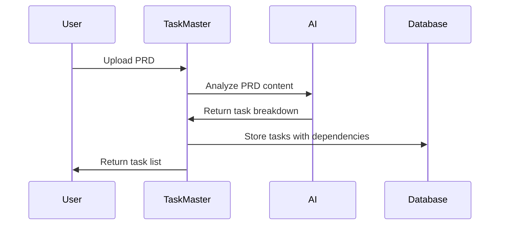
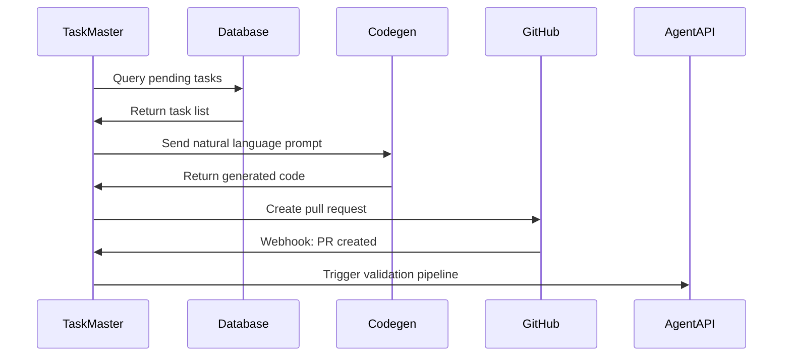
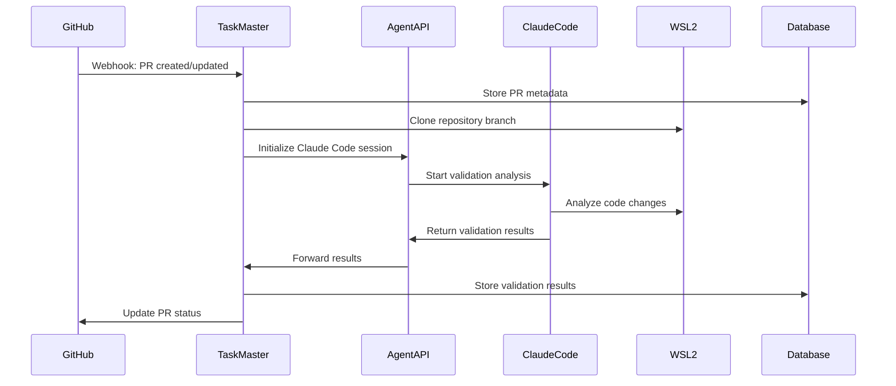
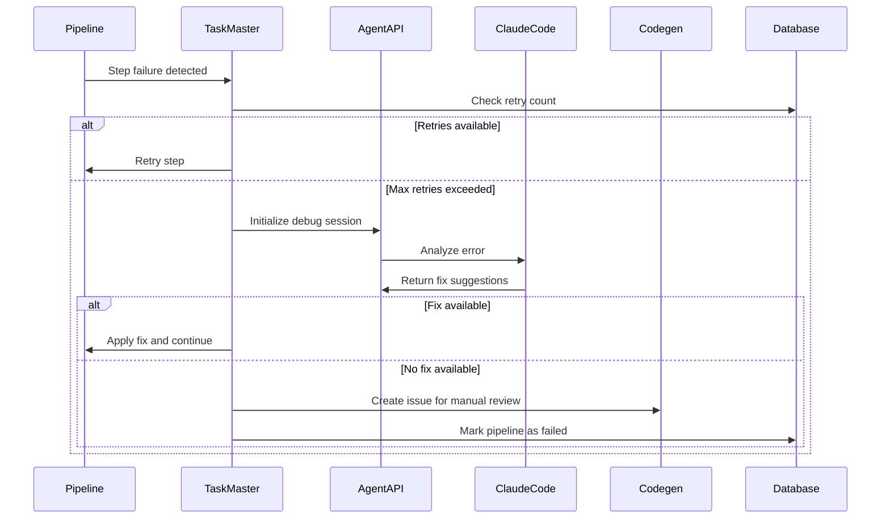

# CI/CD Architecture Documentation

## Overview

Claude Task Master implements a sophisticated AI-powered CI/CD orchestration system that automates the entire software development lifecycle. This document provides a comprehensive overview of the architecture, components, and workflows.

## System Architecture

### High-Level Architecture

```
┌─────────────────────────────────────────────────────────────────────────────┐
│                           External Services                                 │
├─────────────────┬─────────────────┬─────────────────┬─────────────────────┤
│   GitHub/GitLab │   Codegen API   │   Claude Code   │   WSL2 Instances    │
│   Repositories  │   (AI Agent)    │   (AI Agent)    │   (Deployment)      │
└─────────────────┴─────────────────┴─────────────────┴─────────────────────┘
         │                 │                 │                 │
         │                 │                 │                 │
         ▼                 ▼                 ▼                 ▼
┌─────────────────────────────────────────────────────────────────────────────┐
│                      AgentAPI Middleware Layer                              │
│  ┌─────────────────────────────────────────────────────────────────────┐   │
│  │  HTTP API for controlling coding agents (Claude Code, Aider, etc.) │   │
│  │  - Terminal emulation and message parsing                          │   │
│  │  - Session management and state tracking                           │   │
│  │  - Multi-agent coordination                                        │   │
│  └─────────────────────────────────────────────────────────────────────┘   │
└─────────────────────────────────────────────────────────────────────────────┘
         │
         ▼
┌─────────────────────────────────────────────────────────────────────────────┐
│                    Claude Task Master Orchestrator                          │
│  ┌─────────────┐ ┌─────────────┐ ┌─────────────┐ ┌─────────────────────┐   │
│  │   Task      │ │   CI/CD     │ │  AgentAPI   │ │     Webhook         │   │
│  │  Manager    │ │   Engine    │ │   Client    │ │     Handler         │   │
│  │             │ │             │ │             │ │                     │   │
│  │ - PRD Parse │ │ - Pipeline  │ │ - Session   │ │ - GitHub Events     │   │
│  │ - Task Gen  │ │   Execution │ │   Mgmt      │ │ - GitLab Events     │   │
│  │ - Priority  │ │ - Error     │ │ - Message   │ │ - Event Processing  │   │
│  │ - Deps      │ │   Handling  │ │   Routing   │ │ - Async Processing  │   │
│  └─────────────┘ └─────────────┘ └─────────────┘ └─────────────────────┘   │
└─────────────────────────────────────────────────────────────────────────────┘
         │
         ▼
┌─────────────────────────────────────────────────────────────────────────────┐
│                         PostgreSQL Database                                 │
│  ┌─────────────┐ ┌─────────────┐ ┌─────────────┐ ┌─────────────────────┐   │
│  │  Projects   │ │    Tasks    │ │ Pipelines   │ │    Templates        │   │
│  │             │ │             │ │             │ │                     │   │
│  │ - Repos     │ │ - Features  │ │ - Steps     │ │ - Prompts           │   │
│  │ - Config    │ │ - Status    │ │ - Results   │ │ - Workflows         │   │
│  │ - Webhooks  │ │ - Deps      │ │ - Metrics   │ │ - Configurations    │   │
│  └─────────────┘ └─────────────┘ └─────────────┘ └─────────────────────┘   │
└─────────────────────────────────────────────────────────────────────────────┘
```

## Component Details

### 1. Claude Task Master Orchestrator (Core System)

The central coordination engine that manages the entire CI/CD lifecycle.

#### Key Responsibilities:
- **Task Management**: PRD parsing, task generation, dependency mapping
- **Pipeline Orchestration**: CI/CD workflow execution and monitoring
- **Event Processing**: Webhook handling and async event processing
- **Agent Coordination**: Managing interactions with AI agents
- **State Management**: Tracking pipeline states and task progress

#### Core Modules:

```typescript
// Task Manager
class TaskManager {
  async parsePRD(filePath: string, projectId: string): Promise<Task[]>
  async createTask(projectId: string, taskData: TaskData): Promise<Task>
  async getNextTask(projectId: string, assignee?: string): Promise<Task>
  async updateTask(taskId: string, updates: TaskUpdates): Promise<Task>
}

// CI/CD Orchestrator
class CICDOrchestrator {
  async processWebhookEvent(eventData: WebhookEvent): Promise<void>
  async createPRPipeline(projectId: string, pullRequestId: string): Promise<Pipeline>
  async validatePRWithClaudeCode(pullRequestId: string): Promise<ValidationResult>
  async generateCodeFromTasks(projectId: string, taskIds: string[]): Promise<CodegenResult>
  async handlePipelineError(pipelineId: string, stepName: string, error: Error): Promise<void>
}
```

### 2. AgentAPI Middleware

HTTP API layer for controlling various coding agents.

#### Supported Agents:
- **Claude Code**: AI-powered code analysis and generation
- **Aider**: AI pair programming assistant
- **Goose**: AI coding agent
- **Codex**: OpenAI's code generation model

#### Key Features:
- Terminal emulation for agent interaction
- Message parsing and session management
- Multi-agent coordination
- Real-time event streaming

#### API Endpoints:
```bash
GET /messages     # Get conversation history
POST /message     # Send message to agent
GET /status       # Get agent status
GET /events       # SSE stream of events
```

### 3. PostgreSQL Database Schema

Comprehensive data model for CI/CD orchestration.

#### Core Tables:

```sql
-- Projects: Repository and configuration management
CREATE TABLE projects (
    id UUID PRIMARY KEY,
    name VARCHAR(255) NOT NULL,
    repository_url VARCHAR(500) NOT NULL,
    repository_owner VARCHAR(255) NOT NULL,
    repository_name VARCHAR(255) NOT NULL,
    webhook_secret VARCHAR(255),
    agentapi_config JSONB DEFAULT '{}',
    claude_code_config JSONB DEFAULT '{}'
);

-- Tasks: Work items and feature tracking
CREATE TABLE tasks (
    id UUID PRIMARY KEY,
    project_id UUID REFERENCES projects(id),
    title VARCHAR(500) NOT NULL,
    description TEXT,
    type VARCHAR(100) DEFAULT 'feature',
    status VARCHAR(50) DEFAULT 'pending',
    priority INTEGER DEFAULT 3,
    dependencies JSONB DEFAULT '[]',
    parent_task_id UUID REFERENCES tasks(id)
);

-- CI/CD Pipelines: Workflow execution tracking
CREATE TABLE ci_cd_pipelines (
    id UUID PRIMARY KEY,
    project_id UUID REFERENCES projects(id),
    pull_request_id UUID REFERENCES pull_requests(id),
    pipeline_type VARCHAR(100) DEFAULT 'validation',
    status VARCHAR(50) DEFAULT 'pending',
    trigger_event VARCHAR(100) NOT NULL,
    branch_name VARCHAR(255) NOT NULL,
    agentapi_session_id VARCHAR(255)
);

-- Pipeline Steps: Individual step tracking
CREATE TABLE pipeline_steps (
    id UUID PRIMARY KEY,
    pipeline_id UUID REFERENCES ci_cd_pipelines(id),
    step_name VARCHAR(255) NOT NULL,
    step_type VARCHAR(100) NOT NULL,
    status VARCHAR(50) DEFAULT 'pending',
    retry_count INTEGER DEFAULT 0,
    max_retries INTEGER DEFAULT 3
);
```

## Workflow Descriptions

### 1. Task Creation and Planning Workflow



**Steps:**
1. User uploads Product Requirements Document (PRD)
2. TaskMaster analyzes PRD using AI
3. AI generates structured task breakdown
4. Tasks stored in database with dependency mapping
5. Priority assignment based on dependencies and complexity

### 2. Code Generation Workflow



**Steps:**
1. TaskMaster queries database for pending tasks
2. Generates natural language prompt for Codegen
3. Codegen API returns generated code
4. TaskMaster creates pull request on GitHub
5. GitHub webhook triggers validation pipeline
6. AgentAPI initiates Claude Code validation

### 3. PR Validation Pipeline



**Steps:**
1. GitHub sends webhook for PR events
2. TaskMaster stores PR metadata in database
3. Repository branch cloned to WSL2 instance
4. AgentAPI initializes Claude Code session
5. Claude Code performs comprehensive analysis
6. Results stored and PR status updated

### 4. Error Handling and Recovery Workflow



**Steps:**
1. Pipeline step failure detected
2. Check retry count and attempt retry if possible
3. If max retries exceeded, escalate to Claude Code
4. Claude Code analyzes error and suggests fixes
5. If fix available, apply and continue pipeline
6. If no fix, create Codegen issue for manual intervention

## Configuration and Setup

### Environment Variables

```bash
# Database Configuration
DB_HOST=localhost
DB_PORT=5432
DB_NAME=claude_task_master
DB_USER=postgres
DB_PASSWORD=secure_password

# API Keys
ANTHROPIC_API_KEY=sk-ant-api03-...
CODEGEN_API_KEY=your-codegen-key
OPENAI_API_KEY=sk-...

# Service URLs
AGENTAPI_URL=http://localhost:3284
CODEGEN_API_URL=https://api.codegen.sh

# WSL2 Configuration
WSL2_INSTANCE_PATH=/mnt/c/projects
```

### AgentAPI Setup

```bash
# Install AgentAPI
go install github.com/Zeeeepa/agentapi@latest

# Start AgentAPI with Claude Code
agentapi server -- claude --allowedTools "Bash(git*) Edit Replace"
```

### Database Migrations

```bash
# Run migrations
npm run db:migrate

# Check migration status
npm run db:status

# Create new migration
npm run db:create-migration "add_new_feature"
```

## Monitoring and Observability

### Health Checks

```bash
curl http://localhost:3000/health
```

### Pipeline Metrics

```sql
-- Pipeline success rate by type
SELECT 
    pipeline_type,
    COUNT(*) as total,
    COUNT(*) FILTER (WHERE status = 'completed') as successful,
    ROUND(COUNT(*) FILTER (WHERE status = 'completed') * 100.0 / COUNT(*), 2) as success_rate
FROM ci_cd_pipelines 
WHERE created_at > NOW() - INTERVAL '30 days'
GROUP BY pipeline_type;

-- Average pipeline duration
SELECT 
    pipeline_type,
    AVG(duration_ms) as avg_duration_ms,
    PERCENTILE_CONT(0.5) WITHIN GROUP (ORDER BY duration_ms) as median_duration_ms
FROM ci_cd_pipelines 
WHERE status = 'completed'
GROUP BY pipeline_type;
```

### Error Analysis

```sql
-- Most common pipeline errors
SELECT 
    step_name,
    COUNT(*) as error_count,
    array_agg(DISTINCT error_message) as error_types
FROM pipeline_steps 
WHERE status = 'failed'
GROUP BY step_name
ORDER BY error_count DESC;
```

## Security Considerations

### Webhook Security
- Verify webhook signatures using shared secrets
- Implement rate limiting for webhook endpoints
- Validate payload structure and content

### API Authentication
- Use JWT tokens for API authentication
- Implement role-based access control
- Secure API key storage and rotation

### Code Execution Security
- Sandbox code execution in isolated WSL2 instances
- Limit file system access and network permissions
- Monitor and log all code execution activities

### Database Security
- Use SSL/TLS for database connections
- Implement connection pooling with proper limits
- Regular security updates and patches

## Performance Optimization

### Database Optimization
- Proper indexing on frequently queried columns
- Connection pooling with read replicas
- Query optimization and caching

### Pipeline Optimization
- Parallel step execution where possible
- Intelligent retry strategies with exponential backoff
- Resource pooling for WSL2 instances

### Caching Strategies
- Query result caching for read-heavy operations
- Template caching for prompt generation
- Session state caching for AgentAPI

## Troubleshooting Guide

### Common Issues

1. **AgentAPI Connection Failed**
   ```bash
   # Check if AgentAPI is running
   curl http://localhost:3284/status
   
   # Restart AgentAPI
   agentapi server -- claude
   ```

2. **Database Connection Issues**
   ```bash
   # Test database connection
   psql -h localhost -U postgres -d claude_task_master
   
   # Check connection pool status
   curl http://localhost:3000/health
   ```

3. **Pipeline Stuck in Running State**
   ```sql
   -- Find stuck pipelines
   SELECT * FROM ci_cd_pipelines 
   WHERE status = 'running' 
   AND started_at < NOW() - INTERVAL '1 hour';
   
   -- Reset stuck pipeline
   UPDATE ci_cd_pipelines 
   SET status = 'failed' 
   WHERE id = 'pipeline-id';
   ```

### Debugging Tools

- **Health Check Endpoint**: `/health`
- **Pipeline Status API**: `/api/pipelines/:id/status`
- **Database Query Tools**: pgAdmin, psql
- **Log Analysis**: Structured JSON logs with correlation IDs

## Future Enhancements

### Planned Features
- Multi-cloud deployment support
- Advanced AI model integration
- Real-time collaboration features
- Enterprise SSO integration
- Advanced analytics dashboard
- Plugin ecosystem for custom integrations

### Scalability Improvements
- Horizontal scaling with load balancers
- Microservices architecture migration
- Event-driven architecture with message queues
- Distributed caching with Redis
- Container orchestration with Kubernetes

---

This architecture provides a robust foundation for AI-powered CI/CD automation while maintaining flexibility for future enhancements and scaling requirements.

