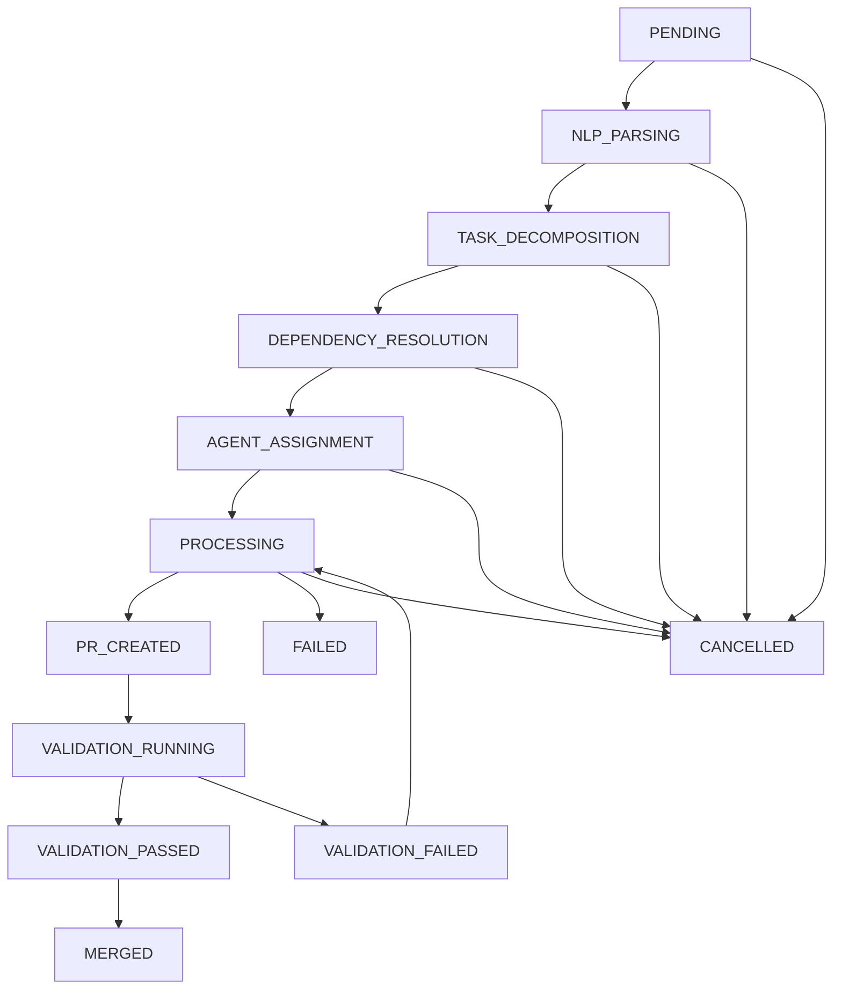

# Task Orchestration Engine

The Task Orchestration Engine is a sophisticated system that processes natural language requirements from a database, converts them to actionable tasks, and coordinates the entire CI/CD workflow through intelligent agent coordination.

## 🎯 Overview

The orchestration engine extends the existing claude-task-master system with advanced capabilities:

- **Natural Language Processing**: Parse and understand task requirements from database
- **Task Decomposition**: Break down complex tasks into atomic, executable units
- **Dependency Resolution**: Manage task dependencies and execution order
- **Workflow Coordination**: Orchestrate the entire CI/CD pipeline
- **State Management**: Track task progress and workflow state
- **Agent Coordination**: Manage multiple coding agents through agentapi
- **Error Recovery**: Handle failures and coordinate retry attempts

## 🏗️ Architecture

### Core Components

```
┌─────────────────────────────────────────────────────────────┐
│                 Orchestration Engine                        │
├─────────────────────────────────────────────────────────────┤
│  ┌─────────────────┐  ┌─────────────────┐  ┌──────────────┐ │
│  │   Task NLP      │  │ State Machine   │  │ Dependency   │ │
│  │   - Parsing     │  │ - Transitions   │  │ Resolver     │ │
│  │   - Analysis    │  │ - Validation    │  │ - Ordering   │ │
│  │   - Generation  │  │ - Monitoring    │  │ - Cycles     │ │
│  └─────────────────┘  └─────────────────┘  └──────────────┘ │
├─────────────────────────────────────────────────────────────┤
│  ┌─────────────────┐  ┌─────────────────┐  ┌──────────────┐ │
│  │ Agent           │  │ Error Recovery  │  │ Database     │ │
│  │ Coordinator     │  │ - Retry Logic   │  │ Manager      │ │
│  │ - Assignment    │  │ - Strategies    │  │ - PostgreSQL │ │
│  │ - Monitoring    │  │ - Patterns      │  │ - State      │ │
│  └─────────────────┘  └─────────────────┘  └──────────────┘ │
├─────────────────────────────────────────────────────────────┤
│                    State Manager                            │
│              - Centralized State                            │
│              - Persistence                                  │
│              - Event Coordination                           │
└─────────────────────────────────────────────────────────────┘
```

### Workflow States

The orchestration engine uses a sophisticated state machine to track workflow progress:

```javascript
const WorkflowStates = {
  PENDING: 'pending',
  PROCESSING: 'processing',
  NLP_PARSING: 'nlp_parsing',
  TASK_DECOMPOSITION: 'task_decomposition',
  DEPENDENCY_RESOLUTION: 'dependency_resolution',
  AGENT_ASSIGNMENT: 'agent_assignment',
  PR_CREATION: 'pr_created',
  VALIDATION_RUNNING: 'validation_running',
  VALIDATION_FAILED: 'validation_failed',
  VALIDATION_PASSED: 'validation_passed',
  MERGED: 'merged',
  FAILED: 'failed',
  CANCELLED: 'cancelled'
};
```

## 🚀 Getting Started

### Installation

The orchestration engine is integrated into the existing claude-task-master system. No additional installation is required.

### Configuration

Configure the orchestration engine through environment variables:

```bash
# Database Configuration
DB_HOST=localhost
DB_PORT=5432
DB_NAME=codegen_taskmaster_db
DB_USER=software_developer
DB_PASSWORD=password

# NLP Configuration
NLP_PROVIDER=anthropic
NLP_MODEL=claude-3-5-sonnet-20241022
ANTHROPIC_API_KEY=your_api_key

# Agent API Configuration
AGENTAPI_URL=http://localhost:8000
AGENTAPI_KEY=your_api_key

# Orchestration Settings
MAX_CONCURRENT_WORKFLOWS=20
ENABLE_NLP=true
ENABLE_AGENT_COORDINATION=true
```

### Basic Usage

#### Initialize Orchestration Engine

```javascript
import { OrchestrationEngine } from './src/orchestration/index.js';

const engine = new OrchestrationEngine({
  database: {
    host: 'localhost',
    port: 5432,
    database: 'codegen_taskmaster_db'
  },
  nlp: {
    provider: 'anthropic',
    model: 'claude-3-5-sonnet-20241022'
  }
});

await engine.initialize();
```

#### Process a Task

```javascript
// Process single task
const result = await engine.processTask('task_123', {
  priority: 'high',
  enableNLP: true,
  enableAgentCoordination: true
});

console.log(`Workflow ${result.workflowId} started`);
```

#### Process Multiple Tasks

```javascript
// Process batch of tasks
const batchResult = await engine.processBatch(['task_1', 'task_2', 'task_3'], {
  priority: 'medium'
});

console.log(`Processed ${batchResult.total} tasks`);
```

#### Monitor Workflow

```javascript
// Get workflow status
const status = await engine.getWorkflowStatus(workflowId);
console.log(`Status: ${status.status}, Progress: ${status.progress}%`);

// Cancel workflow if needed
await engine.cancelWorkflow(workflowId);
```

## 🛠️ CLI Usage

The orchestration engine extends the existing CLI with new commands:

### Initialize Orchestration

```bash
# Initialize orchestration engine
task-master orchestration init

# Initialize with custom configuration
task-master orchestration init --max-workflows 15 --enable-nlp --enable-agents
```

### Process Tasks

```bash
# Process single task with orchestration
task-master orchestration process 123

# Process with specific options
task-master orchestration process 123 --priority high --timeout 600000

# Process multiple tasks in batch
task-master orchestration batch 123,124,125 --priority medium
```

### Monitor and Status

```bash
# Show orchestration status
task-master orchestration status

# Monitor specific workflow
task-master orchestration monitor workflow_123_456

# Health check
task-master orchestration health
```

### Natural Language Processing

```bash
# Parse natural language requirements
task-master orchestration parse "Create a REST API for user management with authentication"

# Parse with context
task-master orchestration parse "Add unit tests" --context "existing_project"
```

## 🔧 MCP Integration

The orchestration engine is fully integrated with the Model Context Protocol (MCP) server:

### Available MCP Tools

1. **init_orchestration** - Initialize the orchestration engine
2. **process_task_orchestration** - Process a task with orchestration
3. **process_batch_orchestration** - Process multiple tasks in batch
4. **get_workflow_status** - Get workflow status
5. **cancel_workflow** - Cancel a running workflow
6. **get_orchestration_status** - Get engine status and metrics
7. **parse_requirements** - Parse natural language requirements
8. **orchestration_health_check** - Perform health check

### Usage in Cursor/Claude

```javascript
// Initialize orchestration
await mcp.call('init_orchestration', {
  enableNLP: true,
  enableAgentCoordination: true,
  maxConcurrentWorkflows: 10
});

// Process task
await mcp.call('process_task_orchestration', {
  taskId: '123',
  priority: 'high',
  enableNLP: true
});

// Parse requirements
await mcp.call('parse_requirements', {
  description: "Create a user authentication system with JWT tokens",
  priority: 'high'
});
```

## 🧠 Natural Language Processing

The NLP module processes natural language requirements and converts them to actionable tasks:

### Features

- **Requirement Parsing**: Extract actionable items from descriptions
- **Task Classification**: Categorize tasks by type and complexity
- **Dependency Identification**: Find relationships between tasks
- **Instruction Generation**: Create detailed instructions for agents
- **Completion Validation**: Verify task completion against requirements

### Example

```javascript
const nlp = new TaskNLP({
  provider: 'anthropic',
  model: 'claude-3-5-sonnet-20241022'
});

const result = await nlp.parseRequirements(
  "Create a REST API for user management with authentication, including login, registration, and password reset functionality"
);

// Result contains:
// - actionableItems: Array of specific tasks
// - dependencies: Task relationships
// - metadata: Complexity, technologies, risks
```

## 🤖 Agent Coordination

The agent coordinator manages multiple coding agents through agentapi:

### Supported Agents

- **Claude Code**: Full-stack development, testing, debugging
- **Goose**: Backend development, CLI tools, automation
- **Aider**: Code editing, git integration, incremental development
- **Codex**: Code completion, generation, translation

### Agent Selection

The system automatically selects the best agent based on:

- Task type and requirements
- Programming language
- Agent capabilities and specialties
- Current availability and load

### Example

```javascript
const coordinator = new AgentCoordinator({
  agentApiUrl: 'http://localhost:8000',
  maxConcurrentAgents: 5
});

// Assign tasks to agents
const assignments = await coordinator.assignTasks(executionPlan);

// Execute with assigned agent
const result = await coordinator.executeTask(assignment, context);
```

## 🗄️ Database Integration

The orchestration engine uses PostgreSQL for persistent state management:

### Schema

```sql
-- Tasks table
CREATE TABLE tasks (
  id VARCHAR PRIMARY KEY,
  title VARCHAR NOT NULL,
  description TEXT,
  status VARCHAR DEFAULT 'pending',
  priority VARCHAR DEFAULT 'medium',
  dependencies JSONB DEFAULT '[]',
  metadata JSONB DEFAULT '{}',
  created_at TIMESTAMP DEFAULT NOW(),
  updated_at TIMESTAMP DEFAULT NOW()
);

-- Workflows table
CREATE TABLE workflows (
  id VARCHAR PRIMARY KEY,
  task_id VARCHAR REFERENCES tasks(id),
  status VARCHAR DEFAULT 'pending',
  start_time TIMESTAMP,
  end_time TIMESTAMP,
  result JSONB,
  metadata JSONB DEFAULT '{}',
  created_at TIMESTAMP DEFAULT NOW(),
  updated_at TIMESTAMP DEFAULT NOW()
);

-- Workflow history
CREATE TABLE workflow_history (
  id SERIAL PRIMARY KEY,
  workflow_id VARCHAR REFERENCES workflows(id),
  from_state VARCHAR,
  to_state VARCHAR,
  timestamp TIMESTAMP DEFAULT NOW(),
  metadata JSONB DEFAULT '{}'
);

-- Agents table
CREATE TABLE agents (
  id VARCHAR PRIMARY KEY,
  name VARCHAR NOT NULL,
  type VARCHAR,
  capabilities JSONB DEFAULT '[]',
  status VARCHAR DEFAULT 'available',
  metadata JSONB DEFAULT '{}',
  created_at TIMESTAMP DEFAULT NOW(),
  updated_at TIMESTAMP DEFAULT NOW()
);
```

## 🔄 Workflow Execution

### Execution Flow

1. **Task Retrieval**: Fetch task from database
2. **NLP Parsing**: Parse natural language requirements
3. **Task Decomposition**: Break into atomic subtasks
4. **Dependency Resolution**: Determine execution order
5. **Agent Assignment**: Assign tasks to appropriate agents
6. **Execution Monitoring**: Track progress and handle errors
7. **Validation**: Verify completion and quality
8. **Completion**: Update status and notify stakeholders

### State Transitions



## 🛡️ Error Handling

The orchestration engine includes sophisticated error recovery:

### Error Types

- **Network Errors**: Connection failures, timeouts
- **Rate Limit Errors**: API rate limiting
- **Dependency Errors**: Missing dependencies, circular references
- **Resource Errors**: Memory, disk, or processing limits
- **Validation Errors**: Invalid input or configuration
- **Agent Errors**: Agent failures or unavailability

### Recovery Strategies

- **Exponential Backoff**: For network and rate limit errors
- **Dependency Resolution**: For dependency conflicts
- **Resource Optimization**: For resource constraints
- **Agent Reassignment**: For agent failures

### Example

```javascript
const errorRecovery = new ErrorRecoveryManager(orchestrator);

// Register custom recovery strategy
errorRecovery.registerRecoveryStrategy('CUSTOM_ERROR', {
  name: 'custom_recovery',
  maxAttempts: 3,
  baseDelay: 5000,
  recoveryAction: async (workflowId, error, context) => {
    // Custom recovery logic
    return await customRecoveryFunction(workflowId, error, context);
  }
});
```

## 📊 Monitoring and Metrics

### Performance Metrics

- **Workflow Throughput**: Tasks processed per hour
- **Success Rate**: Percentage of successful workflows
- **Average Execution Time**: Mean time to completion
- **Agent Utilization**: Usage statistics per agent type
- **Error Rates**: Frequency and types of errors

### Health Monitoring

```javascript
// Get comprehensive health status
const health = await engine.healthCheck();

// Check specific components
console.log('Database:', health.components.database.status);
console.log('NLP:', health.components.nlp?.status);
console.log('Agents:', health.components.agentCoordinator?.status);
```

## 🔧 Configuration

### Environment Variables

| Variable | Description | Default |
|----------|-------------|---------|
| `DB_HOST` | PostgreSQL host | `localhost` |
| `DB_PORT` | PostgreSQL port | `5432` |
| `DB_NAME` | Database name | `codegen_taskmaster_db` |
| `DB_USER` | Database user | `software_developer` |
| `DB_PASSWORD` | Database password | `password` |
| `NLP_PROVIDER` | NLP provider (anthropic/openai) | `anthropic` |
| `NLP_MODEL` | NLP model name | `claude-3-5-sonnet-20241022` |
| `AGENTAPI_URL` | Agent API URL | `http://localhost:8000` |
| `AGENTAPI_KEY` | Agent API key | - |
| `MAX_CONCURRENT_WORKFLOWS` | Max concurrent workflows | `20` |
| `ENABLE_NLP` | Enable NLP processing | `true` |
| `ENABLE_AGENT_COORDINATION` | Enable agent coordination | `true` |

### Programmatic Configuration

```javascript
const engine = new OrchestrationEngine({
  database: {
    host: 'db.example.com',
    port: 5432,
    database: 'production_db',
    ssl: true
  },
  nlp: {
    provider: 'anthropic',
    model: 'claude-3-5-sonnet-20241022',
    enableCaching: true
  },
  orchestrator: {
    maxConcurrentWorkflows: 50,
    taskTimeout: 1800000, // 30 minutes
    retryAttempts: 5
  }
});
```

## 🧪 Testing

### Unit Tests

```bash
# Run orchestration engine tests
npm test -- --grep "orchestration"

# Run specific component tests
npm test -- --grep "TaskNLP"
npm test -- --grep "WorkflowStateMachine"
npm test -- --grep "DependencyResolver"
```

### Integration Tests

```bash
# Run end-to-end orchestration tests
npm run test:e2e -- orchestration

# Test with real database
npm run test:integration -- --database
```

### Performance Tests

```bash
# Load testing with multiple concurrent workflows
npm run test:performance -- --workflows 100 --concurrent 20
```

## 🚀 Deployment

### Production Setup

1. **Database Setup**:
   ```sql
   -- Create database and user
   CREATE DATABASE codegen_taskmaster_db;
   CREATE USER software_developer WITH PASSWORD 'secure_password';
   GRANT ALL PRIVILEGES ON DATABASE codegen_taskmaster_db TO software_developer;
   ```

2. **Environment Configuration**:
   ```bash
   # Production environment
   NODE_ENV=production
   DB_HOST=prod-db.example.com
   DB_PASSWORD=secure_password
   ANTHROPIC_API_KEY=prod_api_key
   AGENTAPI_URL=https://agentapi.example.com
   ```

3. **Process Management**:
   ```bash
   # Using PM2
   pm2 start ecosystem.config.js
   
   # Using Docker
   docker-compose up -d orchestration
   ```

### Scaling Considerations

- **Database Connection Pooling**: Configure appropriate pool sizes
- **Horizontal Scaling**: Multiple orchestrator instances with shared database
- **Load Balancing**: Distribute workflows across instances
- **Monitoring**: Use APM tools for performance monitoring

## 🔍 Troubleshooting

### Common Issues

1. **Database Connection Failures**:
   ```bash
   # Check database connectivity
   task-master orchestration health
   
   # Verify credentials
   psql -h $DB_HOST -U $DB_USER -d $DB_NAME
   ```

2. **NLP Processing Errors**:
   ```bash
   # Check API key configuration
   echo $ANTHROPIC_API_KEY
   
   # Test NLP directly
   task-master orchestration parse "test requirement"
   ```

3. **Agent Coordination Issues**:
   ```bash
   # Check agentapi connectivity
   curl $AGENTAPI_URL/health
   
   # Verify agent availability
   task-master orchestration status
   ```

### Debug Mode

```bash
# Enable debug logging
DEBUG=orchestration:* task-master orchestration process 123

# Verbose output
task-master orchestration process 123 --verbose
```

## 📚 API Reference

### OrchestrationEngine

```javascript
class OrchestrationEngine {
  constructor(options)
  async initialize()
  async processTask(taskId, options)
  async processBatch(taskIds, options)
  async getWorkflowStatus(workflowId)
  async cancelWorkflow(workflowId)
  getMetrics()
  getStatus()
  async healthCheck()
  async shutdown()
}
```

### TaskNLP

```javascript
class TaskNLP {
  constructor(options)
  async parseRequirements(description, context)
  async identifyDependencies(tasks)
  async generateInstructions(task, context)
  async validateCompletion(task, result)
  async decomposeTask(actionableItems, originalTask)
  extractTaskMetadata(description)
}
```

### AgentCoordinator

```javascript
class AgentCoordinator {
  constructor(options)
  async initialize()
  async assignTasks(executionPlan)
  async executeTask(assignment, context)
  async monitorExecution(sessionId)
  async cancelExecution(sessionId)
  getAgentCapabilities(agentType)
  findBestAgent(task, requirements)
  getStatistics()
}
```

## 🤝 Contributing

1. **Fork the repository**
2. **Create a feature branch**: `git checkout -b feature/orchestration-enhancement`
3. **Make changes** and add tests
4. **Run tests**: `npm test`
5. **Submit a pull request**

### Development Setup

```bash
# Clone repository
git clone https://github.com/Zeeeepa/claude-task-master.git
cd claude-task-master

# Install dependencies
npm install

# Set up development database
docker-compose up -d postgres

# Run in development mode
npm run dev
```

## 📄 License

This orchestration engine is part of claude-task-master and is licensed under the MIT License with Commons Clause.

## 🆘 Support

- **Documentation**: [docs/orchestration-engine.md](./orchestration-engine.md)
- **Issues**: [GitHub Issues](https://github.com/Zeeeepa/claude-task-master/issues)
- **Discord**: [TaskMaster AI Community](https://discord.gg/taskmasterai)

---

*The Task Orchestration Engine represents the next evolution of AI-driven development workflows, combining natural language understanding with intelligent agent coordination to create a truly autonomous development system.*

