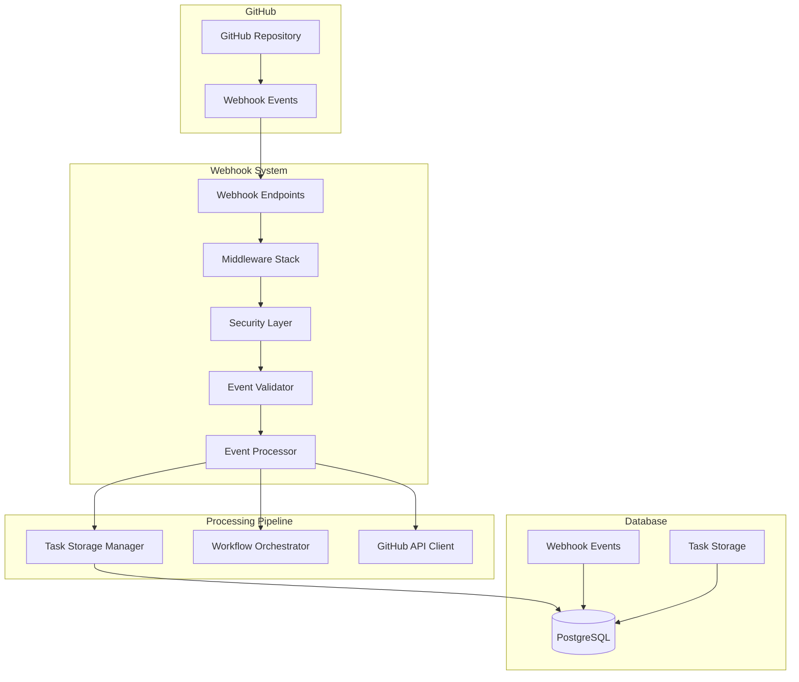

# GitHub Webhook Integration & Event Processing System

## Overview

The GitHub Webhook Integration system is a robust, production-ready solution for capturing GitHub events, processing them through the AI CI/CD pipeline, and triggering automated task creation and workflow orchestration.

## Architecture



## Features

### 🔒 Security
- **Signature Validation**: HMAC-SHA256 signature verification
- **Origin Validation**: User-Agent and IP address checking
- **Payload Validation**: Structure and content verification
- **Rate Limiting**: Configurable request rate limiting
- **Security Headers**: Comprehensive security header management

### 📊 Event Processing
- **Multi-Event Support**: Pull requests, pushes, issues, workflow runs
- **Priority-Based Processing**: Intelligent event prioritization
- **Pipeline Processing**: 6-stage processing pipeline
- **Error Recovery**: Comprehensive error handling and retry mechanisms
- **Duplicate Detection**: Prevents duplicate event processing

### 🚀 Performance
- **Concurrent Processing**: Configurable concurrent event handling
- **Queue Management**: Event processing queue with size limits
- **Timeout Handling**: Request and processing timeouts
- **Memory Optimization**: Efficient memory usage patterns

### 📈 Monitoring
- **Health Checks**: Real-time system health monitoring
- **Metrics Collection**: Comprehensive performance metrics
- **Statistics Tracking**: Event processing statistics
- **Logging**: Structured logging with context

## Quick Start

### 1. Environment Setup

```bash
# Required environment variables
export GITHUB_WEBHOOK_SECRET="your-secure-webhook-secret"
export GITHUB_TOKEN="your-github-token"
export DB_HOST="localhost"
export DB_NAME="codegen-taskmaster-db"
export DB_USER="software_developer"
export DB_PASSWORD="password"
```

### 2. Installation

```bash
npm install
```

### 3. Initialize Database

```bash
# Run database migrations (if available)
npm run db:migrate
```

### 4. Start the Server

```bash
npm start
```

### 5. Configure GitHub Webhook

1. Go to your GitHub repository settings
2. Navigate to "Webhooks"
3. Click "Add webhook"
4. Set the payload URL to: `https://your-domain.com/api/webhooks/github`
5. Set content type to: `application/json`
6. Set the secret to your `GITHUB_WEBHOOK_SECRET`
7. Select events: `Pull requests`, `Pushes`, `Issues`, `Workflow runs`

## Configuration

### Environment Variables

| Variable | Description | Default | Required |
|----------|-------------|---------|----------|
| `GITHUB_WEBHOOK_SECRET` | Webhook signature secret | - | ✅ |
| `GITHUB_TOKEN` | GitHub API token | - | ✅ |
| `WEBHOOK_ENDPOINT` | Webhook endpoint path | `/api/webhooks/github` | ❌ |
| `WEBHOOK_MAX_RETRIES` | Max retry attempts | `3` | ❌ |
| `WEBHOOK_RATE_MAX_REQUESTS` | Rate limit max requests | `100` | ❌ |
| `WEBHOOK_PROCESSING_TIMEOUT` | Processing timeout (ms) | `30000` | ❌ |
| `WEBHOOK_CONCURRENT_LIMIT` | Concurrent processing limit | `10` | ❌ |

### Supported Events

#### Pull Request Events
- `opened` - New pull request created
- `synchronize` - Pull request updated with new commits
- `reopened` - Pull request reopened
- `closed` - Pull request closed (merged or not)

#### Push Events
- Pushes to `main`, `master`, or `develop` branches
- Automatic branch detection based on repository default branch

#### Issue Events
- `opened` - New issue created
- `edited` - Issue updated
- `labeled` - Issue labeled

#### Workflow Run Events
- `completed` - Workflow run completed
- `failed` - Workflow run failed

## API Reference

### Webhook Endpoints

#### `POST /api/webhooks/github`
Main webhook endpoint for GitHub events.

**Headers:**
- `x-github-event`: Event type
- `x-github-delivery`: Unique delivery ID
- `x-hub-signature-256`: HMAC signature
- `user-agent`: GitHub-Hookshot/*

**Response:**
```json
{
  "success": true,
  "eventId": "delivery-id",
  "status": "completed",
  "message": "Event processed successfully",
  "data": {
    "tasksCreated": 1,
    "processingTime": 1250,
    "steps": [...]
  }
}
```

#### `GET /api/webhooks/health`
Health check endpoint.

**Response:**
```json
{
  "success": true,
  "data": {
    "status": "healthy",
    "initialized": true,
    "uptime": 3600,
    "stats": {...}
  }
}
```

#### `GET /api/webhooks/status`
Detailed status and statistics.

**Response:**
```json
{
  "success": true,
  "data": {
    "status": "healthy",
    "statistics": {
      "totalEvents": 150,
      "successfulEvents": 145,
      "failedEvents": 3,
      "skippedEvents": 2,
      "successRate": "96.67%"
    },
    "configuration": {...}
  }
}
```

#### `GET /api/webhooks/metrics`
Prometheus-style metrics.

**Response:**
```json
{
  "success": true,
  "data": {
    "metrics": {
      "webhook_events_total": 150,
      "webhook_events_successful": 145,
      "webhook_processing_time_avg_ms": 1200,
      "webhook_handler_healthy": 1
    }
  }
}
```

### Management Endpoints

#### `GET /api/webhooks/events`
List recent webhook events.

**Query Parameters:**
- `limit`: Number of events to return (default: 50)
- `offset`: Offset for pagination (default: 0)
- `status`: Filter by status
- `type`: Filter by event type
- `repository`: Filter by repository

#### `POST /api/webhooks/replay/:eventId`
Replay a failed webhook event.

#### `DELETE /api/webhooks/events/:eventId`
Delete a webhook event record.

#### `POST /api/webhooks/reset-stats`
Reset webhook statistics.

## Event Processing Pipeline

The webhook system processes events through a 6-stage pipeline:

### 1. validateEvent
- Validates event structure and content
- Checks repository access
- Performs business logic validation

### 2. extractMetadata
- Calculates event priority
- Estimates processing complexity
- Generates event tags
- Extracts contextual information

### 3. createTask
- Creates structured task from event
- Stores task in database
- Generates task requirements
- Sets task priority and metadata

### 4. triggerWorkflow
- Determines appropriate workflows to trigger
- Initiates workflow orchestration
- Handles workflow failures gracefully

### 5. updateStatus
- Updates GitHub commit status/checks
- Provides processing feedback
- Maintains state synchronization

### 6. notifyStakeholders
- Sends notifications to relevant parties
- Handles multiple notification channels
- Tracks notification delivery

## Task Creation

### Pull Request Tasks
```javascript
{
  "id": "webhook-delivery-123-timestamp",
  "type": "webhook_event",
  "source": "github_webhook",
  "event_type": "pull_request",
  "event_action": "opened",
  "title": "Process PR #123: Add new feature",
  "description": "Analyze and process pull request...",
  "priority": "high",
  "requirements": [
    "Code review",
    "Test execution",
    "Security scan"
  ],
  "metadata": {
    "repository": "owner/repo",
    "pr_number": 123,
    "head_sha": "abc123",
    "base_branch": "main"
  }
}
```

### Push Tasks
```javascript
{
  "id": "webhook-delivery-456-timestamp",
  "type": "webhook_event",
  "source": "github_webhook",
  "event_type": "push",
  "event_action": "main",
  "title": "Process push to refs/heads/main",
  "description": "Process push with 3 commits...",
  "priority": "high",
  "requirements": [
    "Continuous integration",
    "Security scan",
    "Deployment pipeline"
  ]
}
```

## Security Considerations

### Webhook Secret
- Use a strong, randomly generated secret (minimum 32 characters)
- Store securely in environment variables
- Rotate regularly (recommended: every 90 days)

### Network Security
- Use HTTPS for all webhook endpoints
- Implement IP allowlisting for GitHub webhook IPs
- Use reverse proxy with rate limiting

### Access Control
- Implement authentication for management endpoints
- Use role-based access control
- Audit all administrative actions

## Monitoring and Alerting

### Key Metrics to Monitor
- **Event Processing Rate**: Events per minute
- **Success Rate**: Percentage of successful events
- **Processing Time**: Average and 95th percentile
- **Error Rate**: Failed events per minute
- **Queue Size**: Number of events in processing queue

### Recommended Alerts
- Processing failure rate > 5%
- Average processing time > 10 seconds
- Queue size > 100 events
- System health check failures

### Log Analysis
```bash
# View recent webhook events
grep "webhook" /var/log/app.log | tail -100

# Monitor error rates
grep "ERROR.*webhook" /var/log/app.log | wc -l

# Check processing times
grep "processing.*duration" /var/log/app.log | awk '{print $NF}'
```

## Troubleshooting

### Common Issues

#### 1. Signature Validation Failures
**Symptoms:** 401 errors, "Invalid webhook signature"
**Solutions:**
- Verify `GITHUB_WEBHOOK_SECRET` matches GitHub configuration
- Check webhook secret in GitHub repository settings
- Ensure payload is not modified by middleware

#### 2. High Processing Times
**Symptoms:** Timeouts, slow responses
**Solutions:**
- Check database connection performance
- Monitor GitHub API rate limits
- Increase processing timeout configuration
- Scale concurrent processing limits

#### 3. Event Processing Failures
**Symptoms:** 422 errors, failed tasks
**Solutions:**
- Check database connectivity
- Verify GitHub API token permissions
- Review event payload structure
- Check workflow orchestrator status

#### 4. Rate Limiting Issues
**Symptoms:** 429 errors, rejected requests
**Solutions:**
- Increase rate limit configuration
- Implement request queuing
- Use multiple webhook endpoints
- Contact GitHub support for higher limits

### Debug Mode

Enable debug logging:
```bash
export LOG_LEVEL=debug
npm start
```

### Health Checks

```bash
# Check webhook system health
curl https://your-domain.com/api/webhooks/health

# Check detailed status
curl https://your-domain.com/api/webhooks/status

# View metrics
curl https://your-domain.com/api/webhooks/metrics
```

## Testing

### Unit Tests
```bash
npm test
```

### Integration Tests
```bash
npm run test:integration
```

### Load Testing
```bash
# Install artillery
npm install -g artillery

# Run load test
artillery run tests/load/webhook-load-test.yml
```

### Manual Testing

Use the provided test script:
```bash
node scripts/test-webhook.js
```

Or use curl:
```bash
# Test webhook endpoint
curl -X POST https://your-domain.com/api/webhooks/github \
  -H "x-github-event: pull_request" \
  -H "x-github-delivery: test-123" \
  -H "x-hub-signature-256: sha256=..." \
  -H "user-agent: GitHub-Hookshot/test" \
  -H "content-type: application/json" \
  -d @test-payload.json
```

## Performance Optimization

### Database Optimization
- Index webhook_events table on commonly queried fields
- Implement event cleanup for old records
- Use connection pooling
- Consider read replicas for analytics

### Caching
- Cache repository information
- Cache GitHub API responses
- Use Redis for session storage

### Scaling
- Horizontal scaling with load balancers
- Queue-based processing with Redis/RabbitMQ
- Microservice architecture for high volume

## Deployment

### Docker Deployment
```dockerfile
FROM node:18-alpine
WORKDIR /app
COPY package*.json ./
RUN npm ci --only=production
COPY . .
EXPOSE 3000
CMD ["npm", "start"]
```

### Kubernetes Deployment
```yaml
apiVersion: apps/v1
kind: Deployment
metadata:
  name: webhook-handler
spec:
  replicas: 3
  selector:
    matchLabels:
      app: webhook-handler
  template:
    metadata:
      labels:
        app: webhook-handler
    spec:
      containers:
      - name: webhook-handler
        image: your-registry/webhook-handler:latest
        ports:
        - containerPort: 3000
        env:
        - name: GITHUB_WEBHOOK_SECRET
          valueFrom:
            secretKeyRef:
              name: webhook-secrets
              key: github-secret
```

### Production Checklist

- [ ] Environment variables configured
- [ ] Database migrations applied
- [ ] SSL certificates installed
- [ ] Monitoring and alerting configured
- [ ] Log aggregation setup
- [ ] Backup procedures in place
- [ ] Security scanning completed
- [ ] Load testing performed
- [ ] Documentation updated
- [ ] Team training completed

## Contributing

### Development Setup
1. Clone the repository
2. Install dependencies: `npm install`
3. Set up environment variables
4. Run tests: `npm test`
5. Start development server: `npm run dev`

### Code Style
- Use ESLint configuration
- Follow existing patterns
- Add tests for new features
- Update documentation

### Pull Request Process
1. Create feature branch
2. Implement changes with tests
3. Update documentation
4. Submit pull request
5. Address review feedback

## Support

For issues and questions:
- Create GitHub issue
- Check troubleshooting guide
- Review logs and metrics
- Contact development team

## License

MIT License - see LICENSE file for details.

