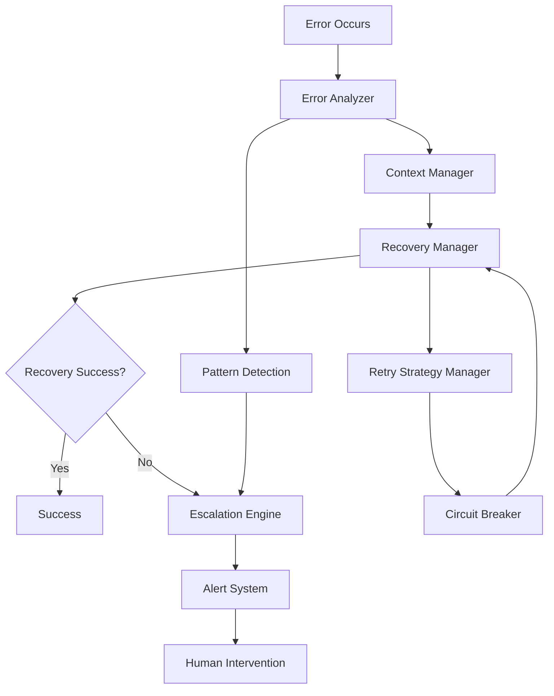

# 🔄 Intelligent Error Handling & Auto-Recovery System

A comprehensive, intelligent error handling and auto-recovery system designed for AI-driven CI/CD workflows. This system provides advanced error analysis, intelligent recovery strategies, automated escalation management, and robust retry mechanisms.

## 🎯 Overview

The Intelligent Error Handling & Auto-Recovery System is a production-ready solution that:

- **Intelligently analyzes** errors with advanced categorization and root cause analysis
- **Automatically recovers** from failures using adaptive strategies
- **Manages escalations** with intelligent routing and SLA tracking
- **Implements robust retry** mechanisms with circuit breakers and adaptive backoff
- **Preserves context** across retry attempts and recovery operations
- **Provides comprehensive alerting** through multiple notification channels

## 🏗️ Architecture



## 📦 Components

### 1. Error Analyzer (`error_analyzer.js`)
- **Advanced error categorization** (syntax, runtime, network, etc.)
- **Root cause analysis** with confidence scoring
- **Pattern detection** for recurring issues
- **Fix suggestion generation**
- **Context extraction** from stack traces and environment

### 2. Recovery Manager (`recovery_manager.js`)
- **Intelligent recovery strategies** (retry, rollback, fallback, repair)
- **State management** with checkpoint creation
- **Resource cleanup** after failed attempts
- **Strategy selection** based on error analysis
- **Performance tracking** and optimization

### 3. Escalation Engine (`escalation_engine.js`)
- **Multi-level escalation** (Low, Medium, High, Critical, Emergency)
- **SLA tracking** and breach detection
- **Automated notifications** to appropriate teams
- **Priority-based routing** of issues
- **Human intervention** request mechanisms

### 4. Retry Strategy Manager (`retry_strategies.js`)
- **Multiple retry strategies** (fixed, linear, exponential backoff)
- **Circuit breaker** pattern implementation
- **Adaptive strategies** based on historical performance
- **Jitter support** to prevent thundering herd
- **Bulkhead isolation** for different operation types

### 5. Context Manager (`context_manager.js`)
- **Context preservation** across retry attempts
- **Intelligent data compression** and storage
- **Selective preservation** based on usage patterns
- **Context linking** for related operations
- **Memory management** with automatic cleanup

### 6. Alert System (`alert_system.js`)
- **Multi-channel notifications** (Email, Slack, SMS, Webhook)
- **Rate limiting** to prevent alert spam
- **Deduplication** of similar alerts
- **Template-based** message generation
- **Delivery tracking** and retry mechanisms

## 🚀 Quick Start

### Basic Usage

```javascript
import IntelligentErrorHandlingSystem from './src/ai_cicd_system/error_handling/index.js';

// Initialize the system
const errorSystem = new IntelligentErrorHandlingSystem({
    enableAnalysis: true,
    enableRecovery: true,
    enableEscalation: true,
    enableRetry: true,
    enableContext: true,
    enableAlerts: true
});

// Handle an error
try {
    // Your operation that might fail
    await riskyOperation();
} catch (error) {
    const result = await errorSystem.handleError(error, {
        operation: 'riskyOperation',
        userId: 'user123',
        requestId: 'req456'
    });
    
    console.log('Error handling result:', result);
}
```

### Execute with Auto-Recovery

```javascript
// Execute operation with automatic retry and recovery
const result = await errorSystem.executeWithErrorHandling(
    async () => {
        // Your operation
        return await apiCall();
    },
    {
        maxRetries: 3,
        retryStrategy: 'EXPONENTIAL_BACKOFF',
        errorCategory: 'NETWORK_ERROR',
        operationKey: 'api_call'
    }
);
```

## ⚙️ Configuration

### System Configuration

```javascript
const config = {
    // System-wide settings
    enableSystem: true,
    maxConcurrentOperations: 10,
    systemTimeout: 300000,

    // Component configurations
    errorAnalyzer: {
        enablePatternLearning: true,
        enableContextExtraction: true,
        enableRootCauseAnalysis: true,
        maxStackTraceDepth: 10
    },

    recoveryManager: {
        enableAutoRecovery: true,
        maxRecoveryAttempts: 3,
        enableRollback: true,
        enableFallback: true,
        recoveryTimeout: 300000
    },

    escalationEngine: {
        enableEscalation: true,
        escalationThresholds: {
            errorFrequency: 10,
            criticalErrorCount: 3,
            recoveryFailureCount: 5
        },
        notificationChannels: ['email', 'slack']
    },

    retryManager: {
        enableRetry: true,
        defaultMaxRetries: 3,
        defaultBaseDelay: 1000,
        defaultMaxDelay: 30000,
        enableAdaptive: true,
        enableCircuitBreaker: true
    },

    contextManager: {
        enableContextPreservation: true,
        defaultStrategy: 'SELECTIVE',
        maxContextSize: 1048576,
        maxContextAge: 3600000,
        enableCompression: true
    },

    alertSystem: {
        enableAlerts: true,
        defaultChannels: ['console', 'slack'],
        rateLimiting: {
            enabled: true,
            maxAlertsPerMinute: 10,
            maxAlertsPerHour: 100
        },
        deduplication: {
            enabled: true,
            windowMs: 300000
        }
    }
};
```

### Recovery Rules Configuration

The system uses a comprehensive configuration file at `config/error_handling/recovery_rules.json`:

```json
{
  "errorCategories": {
    "NETWORK_ERROR": {
      "retryable": true,
      "maxRetries": 5,
      "recoveryStrategy": "RETRY",
      "escalationThreshold": 10,
      "priority": "MEDIUM"
    }
  },
  "retryStrategies": {
    "EXPONENTIAL_BACKOFF": {
      "baseDelay": 1000,
      "maxDelay": 30000,
      "multiplier": 2,
      "jitterFactor": 0.1
    }
  }
}
```

## 📊 Monitoring & Metrics

### System Status

```javascript
const status = errorSystem.getSystemStatus();
console.log('System State:', status.state);
console.log('Active Operations:', status.activeOperations);
console.log('Component Health:', status.components);
```

### Comprehensive Statistics

```javascript
const stats = errorSystem.getStatistics();
console.log('Success Rate:', stats.overview.successRate);
console.log('Average Duration:', stats.overview.averageDuration);
console.log('Error Rate:', stats.performance.errorRate);
console.log('Recovery Rate:', stats.performance.recoveryRate);
```

### Component-Specific Metrics

```javascript
// Error Analyzer Statistics
const analyzerStats = errorSystem.errorAnalyzer.getStatistics();
console.log('Total Analyses:', analyzerStats.totalAnalyses);
console.log('Category Counts:', analyzerStats.categoryCounts);

// Recovery Manager Statistics
const recoveryStats = errorSystem.recoveryManager.getStatistics();
console.log('Total Attempts:', recoveryStats.totalAttempts);
console.log('Success Rate:', recoveryStats.successRate);

// Escalation Engine Statistics
const escalationStats = errorSystem.escalationEngine.getStatistics();
console.log('Total Escalations:', escalationStats.totalEscalations);
console.log('Active Escalations:', escalationStats.activeEscalations);
```

## 🔧 Advanced Features

### Custom Error Categories

```javascript
// Define custom error handling for specific error types
const customConfig = {
    errorAnalyzer: {
        customCategories: {
            'CUSTOM_API_ERROR': {
                patterns: [/API_RATE_LIMIT/, /API_QUOTA_EXCEEDED/],
                retryable: true,
                recoveryStrategy: 'RETRY',
                escalationThreshold: 5
            }
        }
    }
};
```

### Adaptive Retry Strategies

```javascript
// The system learns from historical performance
const retryConfig = {
    strategy: 'ADAPTIVE',
    enableAdaptive: true,
    // System automatically adjusts based on success rates
};
```

### Circuit Breaker Configuration

```javascript
const circuitBreakerConfig = {
    threshold: 5,           // Failures before opening
    timeout: 60000,         // Time before half-open
    monitoringPeriod: 10000 // Monitoring window
};
```

### Context Preservation Strategies

```javascript
// Different strategies for different scenarios
const contextStrategies = {
    'FULL': 'Preserve all context data',
    'SELECTIVE': 'Preserve only relevant fields',
    'MINIMAL': 'Preserve essential data only',
    'ADAPTIVE': 'Learn from usage patterns'
};
```

## 🚨 Alert Configuration

### Multi-Channel Notifications

```javascript
const alertConfig = {
    channels: {
        email: {
            recipients: ['team@company.com'],
            templates: {
                subject: '[{{priority}}] {{title}}',
                body: '{{message}}\n\nDetails: {{data}}'
            }
        },
        slack: {
            webhook: 'https://hooks.slack.com/...',
            channel: '#alerts'
        },
        sms: {
            provider: 'twilio',
            recipients: ['+1234567890']
        }
    }
};
```

### Escalation Matrix

```javascript
const escalationMatrix = {
    'EMERGENCY': ['oncall-engineer', 'team-lead', 'manager'],
    'CRITICAL': ['oncall-engineer', 'team-lead'],
    'HIGH': ['oncall-engineer'],
    'MEDIUM': ['team-notifications'],
    'LOW': ['team-notifications']
};
```

## 🧪 Testing

### Unit Tests

```bash
npm test src/ai_cicd_system/error_handling/
```

### Integration Tests

```bash
npm run test:integration
```

### Load Testing

```bash
npm run test:load
```

## 🛠️ Maintenance

### Cleanup Script

The system includes an automated cleanup script:

```bash
# Clean old data with default settings
./scripts/error_handling/cleanup_failed_attempts.sh

# Custom cleanup
./scripts/error_handling/cleanup_failed_attempts.sh --max-age 3 --max-size 5000

# Dry run to see what would be cleaned
./scripts/error_handling/cleanup_failed_attempts.sh --dry-run
```

### System Reset

```javascript
// Reset the entire system
await errorSystem.reset({
    force: true,        // Force reset even with active operations
    timeout: 30000      // Wait timeout for graceful shutdown
});
```

## 📈 Performance Optimization

### Best Practices

1. **Configure appropriate retry limits** to prevent infinite loops
2. **Use circuit breakers** for external service calls
3. **Enable context compression** for large data sets
4. **Set up proper monitoring** and alerting thresholds
5. **Regularly clean up** old data using the cleanup script

### Memory Management

- Context data is automatically compressed when beneficial
- Old records are pruned based on age and size limits
- Circuit breakers prevent resource exhaustion
- Cleanup scripts maintain optimal performance

## 🔒 Security Considerations

- **Sensitive data filtering** in error messages and logs
- **Secure credential handling** in recovery operations
- **Encrypted context storage** (optional)
- **Access control** for escalation and alert systems
- **Audit logging** of all error handling operations

## 🤝 Integration Points

### Claude Code Validation
- Receives validation results and error reports
- Triggers recovery for failed validations
- Escalates persistent validation failures

### Codegen API
- Sends fix requests with detailed error context
- Receives generated fixes and applies them
- Tracks fix success rates for learning

### PostgreSQL Database
- Stores error logs and recovery history
- Maintains escalation records and SLA data
- Provides analytics and reporting data

### AgentAPI
- Sends status updates during error handling
- Receives external error notifications
- Coordinates with other system components

### Notification Systems
- Integrates with Slack, email, SMS providers
- Supports webhook notifications
- Provides delivery tracking and retry

## 📚 API Reference

### Main System Methods

- `handleError(error, context, options)` - Handle error with full analysis and recovery
- `executeWithErrorHandling(operation, options)` - Execute operation with auto-recovery
- `getSystemStatus()` - Get current system status and health
- `getStatistics()` - Get comprehensive system statistics
- `reset(options)` - Reset the entire system

### Component Methods

Each component provides its own API for direct interaction when needed. See individual component documentation for details.

## 🐛 Troubleshooting

### Common Issues

1. **High memory usage**: Check context preservation settings and cleanup configuration
2. **Alert spam**: Verify rate limiting and deduplication settings
3. **Recovery failures**: Review recovery strategy configuration and thresholds
4. **Circuit breaker stuck open**: Check failure thresholds and timeout settings

### Debug Mode

```javascript
const debugConfig = {
    verbose: true,
    enableDebugLogs: true,
    preserveAllContext: true
};
```

### Log Analysis

Check the system logs for detailed error handling operations:

```bash
tail -f logs/error_handling_cleanup.log
```

## 📄 License

This error handling system is part of the Claude Task Master project and follows the same licensing terms.

## 🤝 Contributing

Contributions are welcome! Please see the main project's contributing guidelines for details on how to contribute to the error handling system.

---

For more information, see the main [Claude Task Master documentation](../../../README.md).

